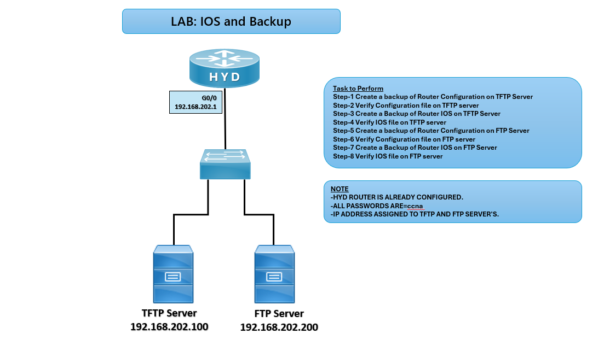

# 💾 IOS Backup Lab (CCNA)

## 🎯 Objective

Perform IOS backup and restore using TFTP and FTP servers, ensuring router configurations and IOS images are safely stored and retrievable.

---
## 🖼️ Lab Topology

---

## 🌐 Network Design

| Device | Interface  |   IP Address    |
| -------| ---------- | --------------- |
| HYD    |    G0/0    | 192.168.202.1   |
| TFTP   |    NIC     | 192.168.202.100 |
| FTP    |    NIC     | 192.168.202.200 |

## ⚙️ Configuration Steps

**HYD Router**

**Backup IOS to TFTP Server**   
copy flash: tftp:  
Enter TFTP server IP (192.168.202.100)  
Enter destination filename  

**Restore IOS from TFTP server to router.**   
copy tftp: flash:  
Enter TFTP server IP  
Enter source filename  

**Backup IOS to FTP server.**  
copy flash: ftp:  
Enter FTP server IP (192.168.202.200)  
Enter username/password  
Enter destination filename  

**Restore IOS from FTP server to router.**  
copy ftp: flash:  
Enter FTP server IP  
Enter credentials  
Enter source filename  

**Verify IOS Image**  
dir flash:  
boot system flash:<filename>  
reload  

## ✅ Verification
Check Flash Contents  
dir flash:  

**Check Boot Configuration**  
show running-config

**Test Reload**      
Router should boot with the restored IOS image.

## Troubleshooting

|            Issue        |               Solution               |
| ----------------------- | ------------------------------------ |
| TFTP not reachable      | Check IP connectivity and firewall   |
| FTP authentication fail | Verify username/password             |
| IOS copy fails          | Ensure enough flash memory available |
| Router boots old IOS    | Update boot system statement         |

## 🌍 Real-World Use Case
- Enterprise backup of router IOS images
- Disaster recovery planning
- Version control of IOS software

## 🎯 Outcome
- Understood IOS backup and restore process
- Practiced TFTP and FTP server usage
- Ensured router resilience with backup strategy

---
## 🙏 Acknowledgment
- This lab guide is part of the CCNA practice series. Thank you for following along and building your skills in networking.

---
## ✍️ Author's Note
- Prepared and documented by Sandeep Gaikwad for CCNA lab practice and GitHub repository organization.

---
## ✅ Closing
- Thank you for reviewing this lab manual. Keep practicing consistently — networking mastery comes with hands-on repetition.
