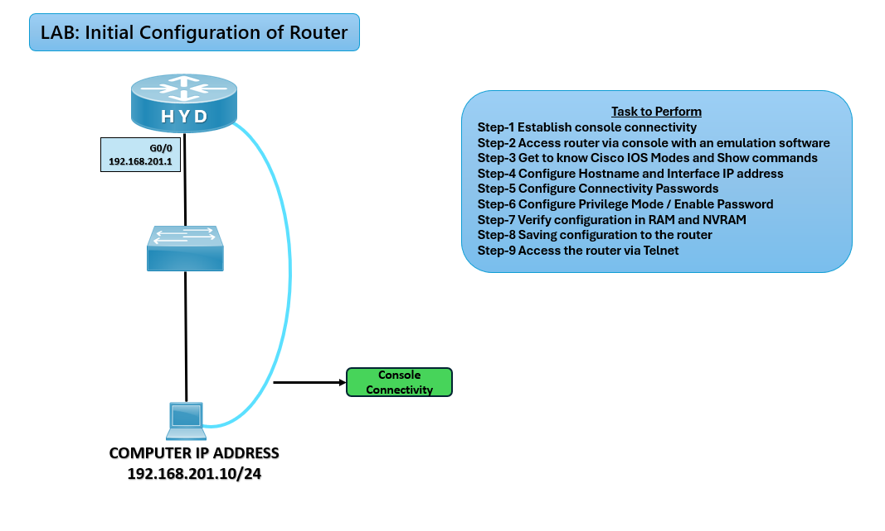

# ⚙️ Initial Router Configuration Lab (CCNA)

## 🎯 Objective

Perform the basic initial configuration of a Cisco router, including hostname, interfaces, passwords, and saving configuration.

---

## 🖼️ Lab Topology



---
| Device | Interface |  IP Address    |
| ------ | --------- | -------------- |
| Router | G0/0      | 192.168.201.1  |
| PC     | NIC       | 192.168.201.10 |

---

## ⚙️ Configuration Steps

```bash

### 🔴 Basic Setup

enable
configure terminal
hostname HYD

### 🔒 Secure Access

enable secret ccna
line console 0
password ccna
login
exit

line vty 0 4
password ccna
login
exit

### 🌐 Interface Configuration

interface g0/0
ip address 192.168.201.1 255.255.255.0
no shutdown
exit

### 💾 Save Configuration
copy running-config startup-config

✅ Verification
show ip interface brief
✅ Interfaces should display up/up with correct IPs.

ping 192.168.201.10
✅ Successful ping to PC.

show running-config
✅ Hostname, passwords, and interface settings confirmed.

|           Issue          |             Solution                |
| ------------------------ | ----------------------------------- |
| Interface down/down      | Use ``no ``shutdown``               |
| No ping response         | Verify IP addressing and cabling    |
| Password not working     | Ensure ``login`` is applied on line |
| Config lost after reload | Use ``copy ``run ``start`` to save  |

🌍 Real-World Use Case
First-time router deployment in enterprise networks
Preparing routers for advanced configurations (RIP, EIGRP, BGP, ACLs)
Ensuring secure and persistent setup

🎯 Outcome
Router uniquely identified with hostname
Interfaces configured with IP addresses
Secure access with passwords
Configuration saved for persistence

