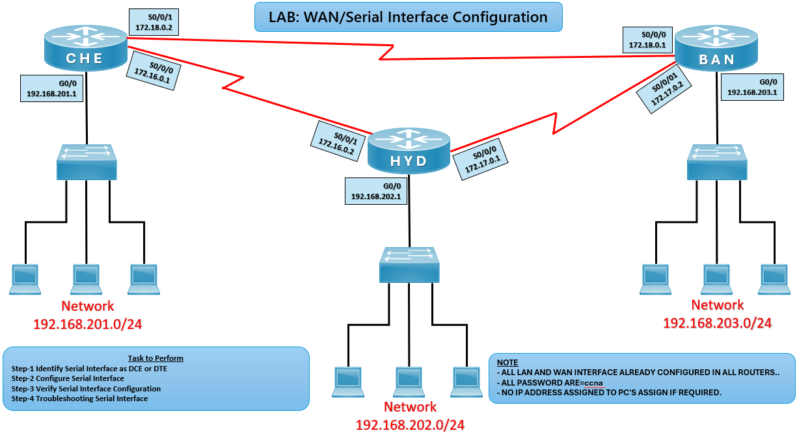

# 🌐 WAN / Serial Interface Configuration Lab (CCNA)

## 🎯 Objective

Configure and verify WAN serial interfaces between routers, ensuring proper DCE/DTE setup, IP addressing, and connectivity across networks.

---

## 🖼️ Lab Topology



---

# Router Interface Table

| Router | Interface | IP Address    | Connected To |
|--------|-----------|---------------|--------------|
| CHE    | G0/0      | 192.168.201.1 | CHE LAN      |
| CHE    | S0/0/0    | 172.16.0.1    | HYD S0/0/1   |
| CHE    | S0/0/1    | 172.18.0.2    | BAN S0/0/0   |
| HYD    | G0/0      | 192.168.202.1 | HYD LAN      |
| HYD    | S0/0/0    | 172.17.0.1    | BAN S0/0/1   |
| HYD    | S0/0/1    | 172.16.0.2    | CHE S0/0/0   |
| BAN    | G0/0      | 192.168.203.1 | BAN LAN      |
| BAN    | S0/0/0    | 172.18.0.1    | CHE S0/0/1   |
| BAN    | S0/0/1    | 172.17.0.2    | HYD S0/0/0   |

---

## ⚙️ Configuration Steps

```bash

### 🔴 CHE Router
conf t
interface s0/0/0
ip address 172.16.0.1 255.255.255.0
clock rate 64000   # if DCE
no shutdown
exit

interface s0/0/1
ip address 172.18.0.2 255.255.255.0
no shutdown
exit

### 🔵 HYD Router
conf t
interface s0/0/0
ip address 172.17.0.1 255.255.255.0
clock rate 64000   # if DCE
no shutdown
exit

interface s0/0/1
ip address 172.16.0.2 255.255.255.0
no shutdown
exit

### 🔵 BAN Router
conf t
interface s0/0/0
ip address 172.18.0.1 255.255.255.0
clock rate 64000   # if DCE
no shutdown
exit

interface s0/0/1
ip address 172.17.0.2 255.255.255.0
no shutdown
exit

✅ Verification
show ip interface brief
✅ Interfaces should show up/up with correct IPs.

ping 192.168.202.1
ping 192.168.203.1
✅ Successful ping confirms WAN connectivity.

show controllers serial 0/0/0
✅ Confirms whether interface is DCE or DTE.

# Common Router Issues and Solutions

| Issue                | Solution                                |
|----------------------|-----------------------------------------|
| Interface down/down  | Use `no shutdown`                       |
| No ping response     | Verify IP addressing and cabling        |
| Clock rate missing   | Configure clock rate on DCE side        |
| Wrong subnet         | Check subnet mask consistency           |

🌍 Real-World Use Case
WAN connectivity between branch offices
Serial link configuration in legacy networks
Foundation for dynamic routing protocols (RIP, EIGRP, BGP)

🎯 Outcome
Configured WAN serial interfaces
Verified DCE/DTE setup and IP addressing
Achieved connectivity across routers and LANs
