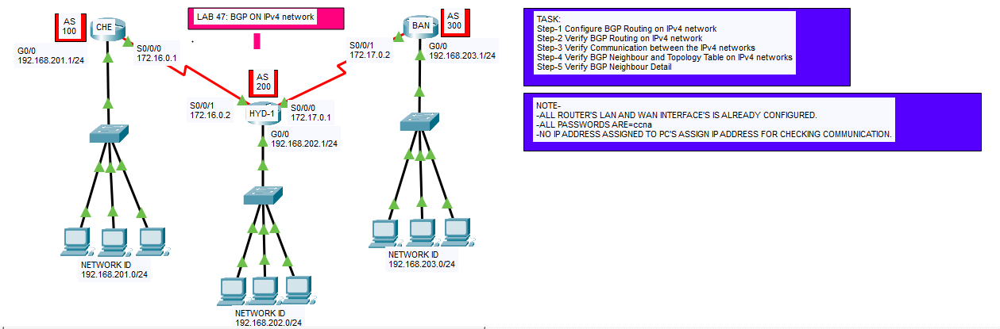

# BGP Routing Lab (CCNA)

## 📌 Objective
Configure Border Gateway Protocol (BGP) between routers belonging to different Autonomous Systems (AS) and verify route exchange.

BGP is used to exchange routing information between different networks (AS). 【1-47791b】

---

## 🖼️ Lab Topology



---

## 🌐 Network Design

| Router | LAN Network | AS Number |
|--------|------------|-----------|
| CHE    | 192.168.201.0/24 | 100 |
| HYD    | 192.168.202.0/24 | 200 |
| BAN    | 192.168.203.0/24 | 300 |

WAN Links:
- CHE ↔ HYD → 172.16.0.0/30  
- HYD ↔ BAN → 172.17.0.0/30  
- CHE ↔ BAN → 172.18.0.0/30  

---

## ⚙️ Configuration Steps

---

### Configure BGP on Routers

### 🔴 **CHE Router (AS 100)**

```bash
conf t
router bgp 100
neighbor 172.16.0.2 remote-as 200
neighbor 172.18.0.1 remote-as 300
network 192.168.201.0 mask 0.0.0.255

### 🔵 **HYD Router (AS 200)**

conf t
router bgp 200
neighbor 172.16.0.1 remote-as 100
neighbor 172.17.0.2 remote-as 300
network 192.168.202.0 mask 255.255.255.0

### 🔵 **BAN Router (AS 300)**

conf t
router bgp 300
neighbor 172.17.0.1 remote-as 200
neighbor 172.18.0.2 remote-as 100
network 192.168.203.0 mask 255.255.255.0

✅ Verification
Check BGP Neighbors
show ip bgp summary

✅ Expect:
State = Established

Check Routes Learned via BGP
show ip route
show ip bgp

Test Connectivity
ping 192.168.202.1
ping 192.168.203.1

🚨 Troubleshooting
| Issue                     | Fix                     |
| ------------------------- | ----------------------- |
| Neighbor not forming      | Check IP connectivity   |
| BGP state not Established | Verify AS number        |
| No routes                 | Check `network` command |
| No ping                   | Check routing table     |
