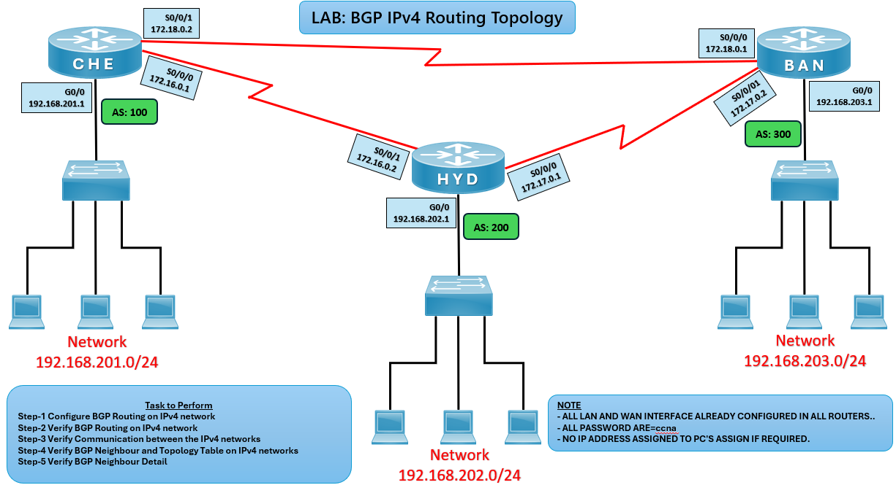

# 🔄 BGP Routing Lab (CCNA)

## 🎯 Objective

Configure **BGP (Border Gateway Protocol)** between routers and verify dynamic routing and neighbor relationships.

## 🖼️ Lab Topology

| Router |    LAN Network   | AS Number |
| ------ | ---------------- | --------- |
| CHE    | 192.168.201.0/24 |    100    |
| HYD    | 192.168.202.0/24 |    200    |
| BAN    | 192.168.203.0/24 |    300    |

---

## ⚙️ Configuration Steps

### 🔴 CHE Router (AS 100)

conf t  
router bgp 100  
neighbor 172.16.0.2 remote-as 200  
neighbor 172.18.0.2 remote-as 300  
network 192.168.201.0 mask 255.255.255.0  

### 🔵 HYD Router (AS 200)

conf t  
router bgp 200  
neighbor 172.16.0.1 remote-as 100  
neighbor 172.17.0.2 remote-as 300  
network 192.168.202.0 mask 255.255.255.0  

### 🔵 BAN Router (AS 300)

conf t  
router bgp 300  
neighbor 172.18.0.1 remote-as 100  
neighbor 172.17.0.1 remote-as 200  
network 192.168.203.0 mask 255.255.255.0  

## ✅ Verification
**Check BGP Neighbors**    
show ip bgp summary  

**Check BGP Routing Table**     
show ip bgp  
show ip route  

**Test Connectivity**  
ping 192.168.202.1 
ping 192.168.203.1

## Troubleshooting

|            Issue      |               Solution                 |
| ----------------------| -------------------------------------- |
| Neighbors not forming | Check IP connectivity and AS numbers   |
| No routes learned     | Verify network statements              |
| Wrong routes          | Check mask and neighbor configs        |
| No ping               | Ensure interfaces are up (no shutdown) |

## 🌍 Real-World Use Case
- ISP interconnections
- Multi-AS enterprise networks
- External routing between different organizations

## 🎯 Outcome
- Understood BGP configuration
- Verified neighbor relationships
- Learned external routing behavior

---
## 🙏 Acknowledgment
- This lab guide is part of the CCNA practice series. Thank you for following along and building your skills in networking.

---
## ✍️ Author's Note
- Prepared and documented by **Sandeep Gaikwad** for CCNA lab practice and GitHub repository organization.

---
## ✅ Closing
- Thank you for reviewing this lab manual. Keep practicing consistently — networking mastery comes with hands-on repetition.
