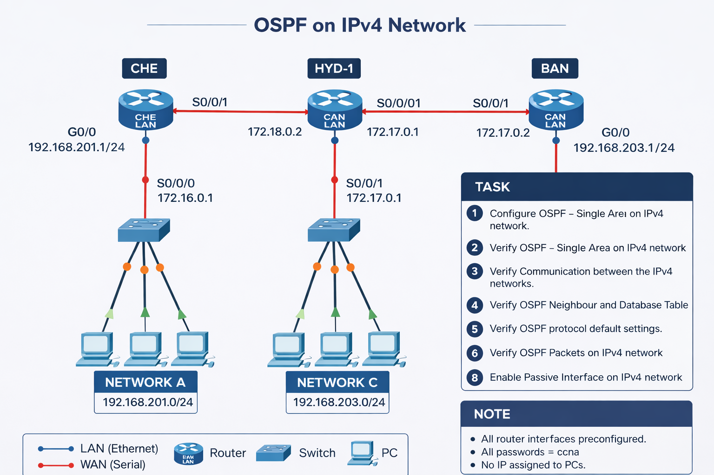

# OSPF (Single Area) Routing Lab (CCNA)

## 🎯 Objective

Configure OSPF (Open Shortest Path First) in a single area (Area 0) and verify neighbor formation and routing table updates.

---

## 🖼️ Lab Topology



---

## 🌐 Network Design

| Router | LAN Network        | OSPF Area |
|--------|--------------------|-----------|
| CHE    | 192.168.201.0/24   | Area 0    |
| HYD    | 192.168.202.0/24   | Area 0    |
| BAN    | 192.168.203.0/24   | Area 0    |

---

## ⚙️ Configuration Steps

```bash

### 🔴 **CHE Router (Area 0)**

conf t
router ospf 1
network 192.168.201.0 0.0.0.255 area 0
network 172.16.0.0 0.0.255.255 area 0
network 172.18.0.0 0.0.255.255 area 0

🔵 HYD Router (Area 0)

conf t
router ospf 1
network 192.168.202.0 0.0.0.255 area 0
network 172.16.0.0 0.0.255.255 area 0
network 172.17.0.0 0.0.0.3 area 0

🔵 BAN Router (Area 0)
conf t
router ospf 1
network 192.168.203.0 0.0.0.255 area 0
network 172.17.0.0 0.0.255.255 area 0
network 172.18.0.0 0.0.255.255 area 0

✅ Verification
🔍 Check OSPF Neighbors

show ip ospf neighbor
✅ Expected: Neighbors should be in FULL state

📊 Check Routing Table

show ip route
✅ Expected: Routes appear with O (OSPF)

🌐 Test Connectivity

ping 192.168.202.1
ping 192.168.203.1
✅ All networks reachable

🛠️ Troubleshooting
| Issue              | Solution                          |
| ------------------ | --------------------------------- |
| No neighbor formed | Check Area mismatch               |
| No routes learned  | Verify network statements         |
| OSPF down          | Check `no shutdown` on interfaces |
| Ping not working   | Verify IP addressing              |

🌍 Real-World Use Case

Enterprise internal routing
Large-scale networks
Fast convergence environments

🎓 Outcome

Configured OSPF in single area
Verified neighbor relationships
Understood routing behavior
