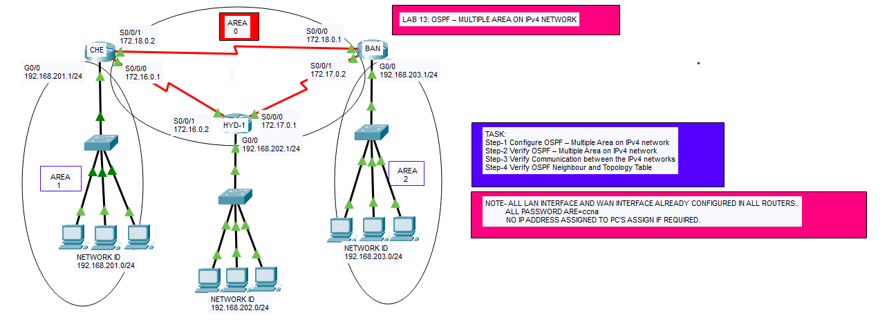

# 🌐 OSPF Multi-Area Routing Lab (CCNA)

---

## 🎯 Objective

Configure **OSPF Multi-Area routing** using:

- ✅ Backbone Area (Area 0)
- ✅ Non-backbone Areas (Area 1 & Area 2)
- ✅ ABR (Area Border Router) functionality  

Verify **neighbor relationships**, **routing table**, and **connectivity**.

---
## 🖼️ Lab Topology


---

## 🔷 Network Design

| Router | LAN Network       | Area   |
|--------|-------------------|--------|
| CHE    | 192.168.201.0/24  | Area 1 |
| HYD    | 192.168.202.0/24  | Area 1 |
| BAN    | 192.168.203.0/24  | Area 2 |

---

## ⚙️ Configuration Steps

```bash

### 🔴 **CHE Router (Area 1 + Area 0)**

conf t
router ospf 1
network 192.168.201.0 0.0.0.255 area 1
network 172.16.0.0 0.0.255.255 area 0
network 172.18.0.0 0.0.255.255 area 0

🔵 HYD Router (ABR - Area 0 + Area 1 + Area 2)

conf t
router ospf 1
network 192.168.202.0 0.0.0.255 area 1
network 172.16.0.0 0.0.0.3 area 0
network 172.17.0.0 0.0.0.3 area 0

🔵 BAN Router (Area 2 + Area 0)

conf t
router ospf 1
network 192.168.203.0 0.0.0.255 area 2
network 172.17.0.0 0.0.0.3 area 0

🔍 Verification
✅ Check OSPF Neighbors

show ip ospf neighbor
✔ All neighbors should be in FULL state

✅ Check Routing Table

show ip route
✔ Routes should appear with O (OSPF)

✅ Check OSPF Database (Advanced)
show ip ospf database

✅ Test Connectivity
ping 192.168.202.1
ping 192.168.203.1

✔ All networks reachable

🛠️ Troubleshooting
| Issue                | Fix                                    |
| -------------------- | -------------------------------------- |
| No neighbor formed   | Check Area mismatch                    |
| Missing routes       | Verify network statements              |
| Partial connectivity | Check ABR config                       |
| Ping failure         | Check interface status (`no shutdown`) |
| No inter-area routes | Ensure backbone (Area 0) connectivity  |

🌍 Real-World Use Case

Large enterprise networks
Multi-region architecture
Scalable hierarchical routing design
Core–Distribution–Access model

✅ Outcome

Implemented OSPF Multi-Area design
Understood ABR role
Verified inter-area routing
Learned hierarchical network architecture
✅ Outcome

Implemented OSPF Multi-Area design
Understood ABR role
Verified inter-area routing
Learned hierarchical network architecture
