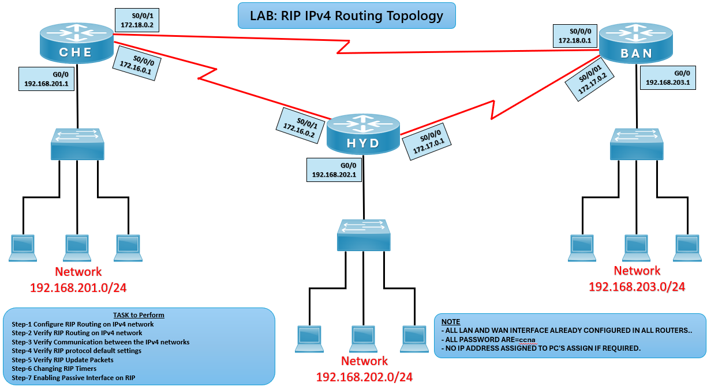

🔄 RIP Routing Lab (CCNA)

🎯 Objective

Configure RIP (Routing Information Protocol) between routers and verify dynamic routing, updates, and communication across IPv4 networks.


## 🖼️ Lab Topology



## 🌐 Network Details

| Router | Interface| IP Address        |
|--------|----------|-------------------|
| CHE    | G0/0     | 192.168.201.1/24  |
| HYD    | G0/0     | 192.168.202.1/24  |
| BAN    | G0/0     | 192.168.203.1/24  |

| Link      | Network        |
|-----------|----------------|
| CHE ↔ HYD | 172.16.0.0 /16 |
| HYD ↔ BAN | 172.17.0.0 /16 |
| CHE ↔ BAN | 172.18.0.0 /16 |

---

## ⚙️ Configuration Steps

```bash
### 🔴 CHE Router

conf t
router rip
network 192.168.201.0
network 172.16.0.0
network 172.18.0.0

### 🔵 HYD Router

conf t
router rip
network 192.168.202.0
network 172.16.0.0
network 172.17.0.0

### 🔵 BAN Router

conf t
router rip
network 192.168.203.0
network 172.17.0.0
network 172.18.0.0

✅ Verification
Check RIP Neighbors / Updates
debug ip rip

Check Routing Table
show ip route

Test Connectivity
ping 192.168.202.1
ping 192.168.203.1

|       Issue       |           Solution             |
| ----------------- | ------------------------------ |
| No routes learned | Check ``network`` statements   |
| Wrong routes      | Verify subnet masks            |
| No ping           | Check interfaces (no shutdown) |
| Updates not seen  | Ensure RIP version 2 enabled   |

🌍 Real-World Use Case
Small enterprise networks
Legacy routing setups
Quick dynamic routing in lab environments

🎯 Outcome
Understood RIP configuration
Verified routing updates
Learned dynamic routing behavior with RIP