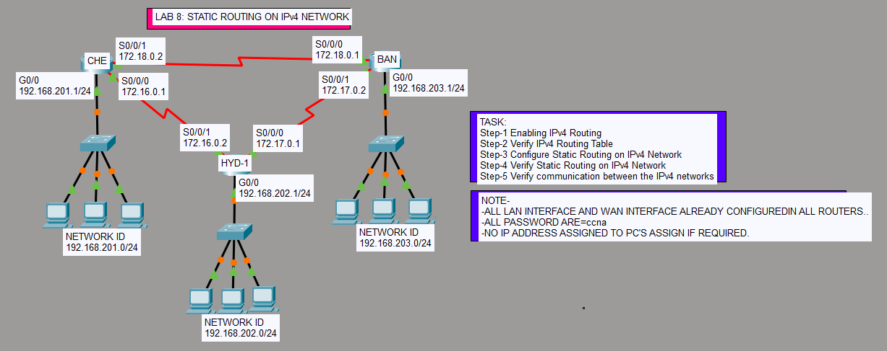

# Static Routing Lab (CCNA)

## 📌 Objective
Configure **static routing manually** between routers and verify end-to-end connectivity between different networks.

Static routing means routes are **manually configured by the administrator** and do not change automatically. 【1-b8790c】

---

## 🔷 Lab Topology


---

## 🌐 Network Details

| Router | Interface | IP Address |
|--------|----------|-----------|
| CHE    | G0/0     | 192.168.201.1/24 |
| HYD    | G0/0     | 192.168.202.1/24 |
| BAN    | G0/0     | 192.168.203.1/24 |

| Link | Network |
|------|--------|
| CHE ↔ HYD | 172.16.0.0 /30 |
| HYD ↔ BAN | 172.17.0.0 /30 |
| CHE ↔ BAN | 172.18.0.0 /30 |

---

## ⚙️ Configuration Steps

### Step 1: Configure Interfaces

#### CHE Router
```bash
conf t
hostname CHE

interface g0/0
ip address 192.168.201.1 255.255.255.0
no shutdown

interface s0/0/0
ip address 172.16.0.1 255.255.255.252
no shutdown

interface s0/0/1
ip address 172.18.0.2 255.255.255.252
no shutdown

## HYD Router
conf t
hostname HYD

interface g0/0
ip address 192.168.202.1 255.255.255.0
no shutdown

interface s0/0/0
ip address 172.16.0.2 255.255.255.252
no shutdown

interface s0/0/1
ip address 172.17.0.1 255.255.255.252
no shutdown

## BAN Router
conf t
hostname BAN

interface g0/0
ip address 192.168.203.1 255.255.255.0
no shutdown

interface s0/0/0
ip address 172.18.0.1 255.255.255.252
no shutdown

interface s0/0/1
ip address 172.17.0.2 255.255.255.252
no shutdown

🚀 Step 2: Configure Static Routes
👉 Static route syntax:
ip route <destination-network> <subnet-mask> <next-hop>

CHE Router Static Routing
ip route 192.168.202.0 255.255.255.0 172.16.0.2
ip route 192.168.203.0 255.255.255.0 172.18.0.1

HYD Router Static Routing
ip route 192.168.201.0 255.255.255.0 172.16.0.1
ip route 192.168.203.0 255.255.255.0 172.17.0.2

BAN Router Static Routing
ip route 192.168.201.0 255.255.255.0 172.18.0.2
ip route 192.168.202.0 255.255.255.0 172.17.0.1

✅ Step 3: Verification

Check Routing Table
show ip route

Look for:
S 192.168.x.x

Test Connectivity
From CHE:
ping 192.168.203.1

From BAN:
ping 192.168.201.1


