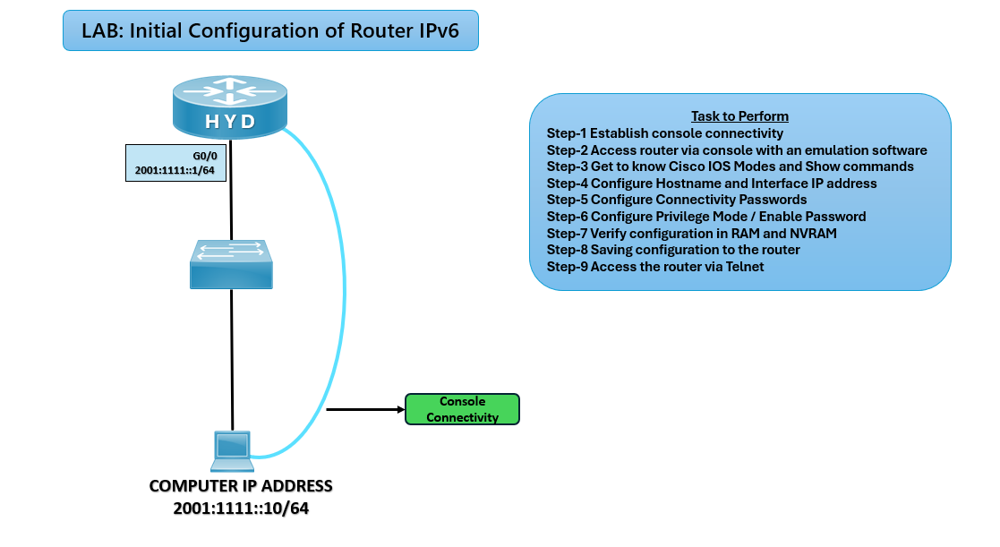

# ⚙️ Initial Router Configuration Lab (CCNA) IPV6

## 🎯 Objective

Perform the basic initial configuration of a Cisco router, including hostname, interfaces, passwords, and saving configuration.

---

## 🖼️ Lab Topology

---
| Device | Interface |  IPv6 Address    |
| ------ | --------- | ---------------- |
| Router | G0/0      | 2001:1111::1/64  |
| PC     | NIC       | 2001:1111::10/64 |

---

## ⚙️ Configuration Steps

### 🔴 Basic Setup

enable  
configure terminal  
hostname HYD  

### 🔒 Secure Access

enable secret ccna  
line console 0  
password ccna  
login  
exit  

line vty 0 4  
password ccna  
login  
exit  

### 🌐 Interface Configuration

interface g0/0  
ipv6 address 2001:1111::1/64  
no shutdown  
exit  

### 💾 Save Configuration  
copy running-config startup-config  

**✅ Verification**  
show ip interface brief

**Expected: ✅ Interfaces should display up/up with correct IPs.*

**Test Connectivity**  
ping 2001:1111::10

**Expected: ✅ Successful ping to PC.*

**Check Running Configuration**  
show running-config

**Verify: ✅ Hostname, passwords, and interface settings confirmed.*

## Troubleshooting

|           Issue          |             Solution                |
| ------------------------ | ----------------------------------- |
| Interface down/down      | Use ``no ``shutdown``               |
| No ping response         | Verify IP addressing and cabling    |
| Password not working     | Ensure ``login`` is applied on line |
| Config lost after reload | Use ``copy ``run ``start`` to save  |

## 🌍 Real-World Use Case
- First-time router deployment in enterprise networks
- Preparing routers for advanced configurations (RIP, EIGRP, BGP, ACLs)
- Ensuring secure and persistent setup

## 🎯 Outcome
- Router uniquely identified with hostname
- Interfaces configured with IP addresses
- Secure access with passwords
- Configuration saved for persistence

---
## 🙏 Acknowledgment
- This lab guide is part of the CCNA practice series. Thank you for following along and building your skills in networking.

---
## ✍️ Author's Note
- Prepared and documented by **Sandeep Gaikwad** for CCNA lab practice and GitHub repository organization.

---
## ✅ Closing
- Thank you for reviewing this lab manual. Keep practicing consistently — networking mastery comes with hands-on repetition.
