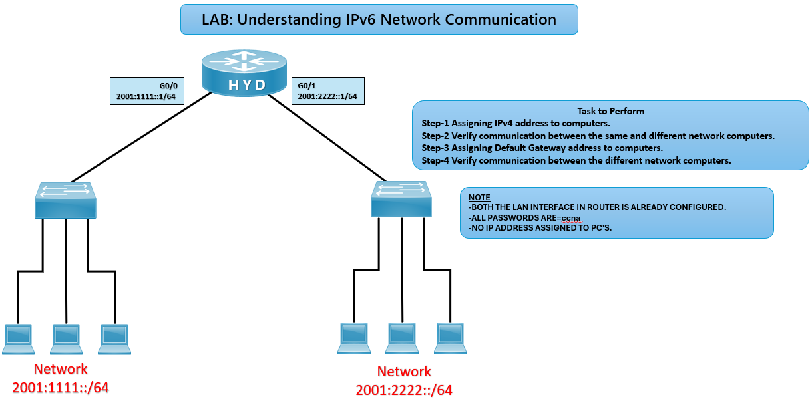

# 💻 Assign IPv6 Address to PC (Packet Tracer)

## 🎯 Objective

Manually configure an IP address, subnet mask, and default gateway on a PC in Cisco Packet Tracer.

## 🖼️ Lab Topology

---

## ⚙️ Configuration Steps

### Step 1: Select the PC
- Click on the PC in Packet Tracer.

### Step 2: Open Desktop Tab
- Go to **Desktop → IP Configuration**.

### Step 3: Assign IP Address
- Enter IP Address: 2001:1111::10 
- Enter Subnet Mask: /64
- Enter Default Gateway: 2001:1111::1

### Step 4: Verify
- Open **Command Prompt** in Desktop tab.
- Run: ping 2001:1111::1

### Step 5: Follow the same step in another PC in different network ie.. 2001:2222::/64

## ✅ Verification
ping 2001:1111::1 → Successful reply confirms connectivity to router.  
ping <other PC IP> → Confirms LAN communication.  
ping <other network PC IP> → Confirms that 2 networks are having communication with the help of router  

## Troubleshooting

|    Issue        |              Solution             |
| --------------- | --------------------------------- |
| Ping fails      | Check IP, mask, and gateway       |
| No connectivity | Ensure cables are correct         |
| Wrong subnet    | Verify subnet mask matches router |

## 🌍 Real-World Use Case
- Assigning static IPs in small office/home networks
- Preparing PCs for router/switch connectivity tests
- Lab practice for CCNA initial setups

## 🎯 Outcome
- PC configured with IP, subnet mask, and gateway
- Verified connectivity with router and LAN devices
- Learned manual IP assignment in Packet Tracer

---
## 🙏 Acknowledgment
- This lab guide is part of the CCNA practice series. Thank you for following along and building your skills in networking.

---
## ✍️ Author's Note
- Prepared and documented by **Sandeep Gaikwad** for CCNA lab practice and GitHub repository organization.

---
## ✅ Closing
- Thank you for reviewing this lab manual. Keep practicing consistently — networking mastery comes with hands-on repetition.
