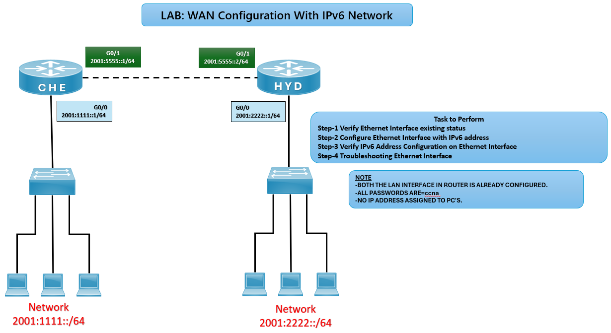

# 🌐 WAN Configuration with IPv6 Lab (CCNA)

## 🎯 Objective

Configure and verify IPv6 addresses on WAN Ethernet interfaces between routers, ensuring proper connectivity and troubleshooting.

---

## 🖼️ Lab Topology

---

# Router IPv6 Interface Table

| Router | Interface | IPv6 Address     | Connected Network |
|--------|-----------|------------------|-------------------|
| CHE    | G0/0      | 2001:1111::1/64  | 2001:1111::/64    |
| CHE    | G0/1      | 2001:5555::1/64  | WAN Link          |
| HYD    | G0/0      | 2001:2222::1/64  | 2001:2222::/64    |
| HYD    | G0/1      | 2001:5555::2/64  | WAN Link          |

---

## ⚙️ Configuration Steps

### 🔴 CHE Router

conf t  
interface g0/0  
ipv6 address 2001:1111::1/64  
no shutdown  
exit  

interface g0/1  
ipv6 address 2001:5555::1/64  
no shutdown  
exit  

### 🔵 HYD Router
conf t  
interface g0/0  
ipv6 address 2001:2222::1/64  
no shutdown  
exit  

interface g0/1  
ipv6 address 2001:5555::2/64  
no shutdown  
exit  

## ✅ Verification  

**show ipv6 interface brief**  
**Expected: ✅ Interfaces should display IPv6 addresses and status up/up.*

**ping 2001:5555::2**  
**Expected: ✅ Successful ping confirms WAN connectivity between CHE and HYD.*

**ping 2001:2222::1**  
**Expected:✅ Confirms LAN-to-LAN communication via WAN link.*

## Common IPv6 Router Issues and Solutions

| Issue                | Solution                                |
|----------------------|-----------------------------------------|
| Interface down/down  | Use `no shutdown`                       |
| No ping response     | Verify IPv6 addressing and cabling      |
| Wrong prefix length  | Ensure `/64` subnet mask applied        |
| PCs not reachable    | Assign IPv6 addresses to PCs            |

## 🌍 Real-World Use Case
- IPv6 WAN connectivity between branch offices
- Transition labs for IPv4 → IPv6 migration
- Foundation for advanced IPv6 routing protocols (OSPFv3, BGP for IPv6)

## 🎯 Outcome
- Configured IPv6 addresses on WAN interfaces
- Verified connectivity between routers and LANs
- Learned IPv6 WAN setup and troubleshooting

---
## 🙏 Acknowledgment
- This lab guide is part of the CCNA practice series. Thank you for following along and building your skills in networking.

---
## ✍️ Author's Note
- Prepared and documented by **Sandeep Gaikwad** for CCNA lab practice and GitHub repository organization.

---
## ✅ Closing
- Thank you for reviewing this lab manual. Keep practicing consistently — networking mastery comes with hands-on repetition.

