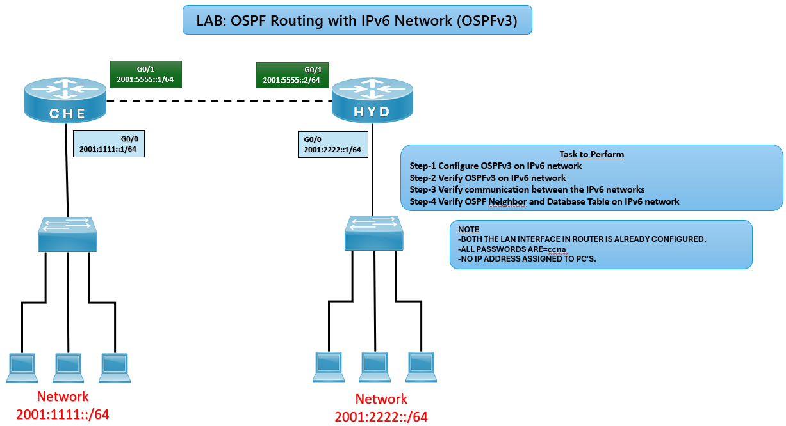

# 🕸️ OSPFv3 Routing Lab (CCNA)

## 🎯 Objective

Configure OSPFv3 (OSPF for IPv6) between routers and verify dynamic routing, neighbor relationships, and communication across IPv6 networks.

## 🖼️ Lab Topology

# Network Design

| Router | Interface | IPv6 Address     | Connected Network |
|--------|-----------|------------------|-------------------|
| CHE    | G0/0      | 2001:1111::1/64  | 2001:1111::/64    |
| CHE    | G0/1      | 2001:5555::1/64  | WAN Link          |
| HYD    | G0/0      | 2001:2222::1/64  | 2001:2222::/64    |
| HYD    | G0/1      | 2001:5555::2/64  | WAN Link          |

---

## ⚙️ Configuration Steps

### 🔴 CHE Router

conf t  
ipv6 unicast-routing  
router ospfv3 10  
router-id 1.1.1.1  
exit

interface g0/0  
ipv6 address 2001:1111::1/64  
ospfv3 10 ipv6 area 0  
no shutdown  
exit

interface g0/1  
ipv6 address 2001:5555::1/64  
ospfv3 10 ipv6 area 0  
no shutdown  
exit

### 🔵 HYD Router

conf t  
ipv6 unicast-routing  
router ospfv3 10  
router-id 2.2.2.2  
exit

interface g0/0  
ipv6 address 2001:2222::1/64  
ospfv3 10 ipv6 area 0  
no shutdown  
exit

interface g0/1  
ipv6 address 2001:5555::2/64  
ospfv3 10 ipv6 area 0  
no shutdown  
exit

## ✅ Verification  
**Check OSPF Neighbors**  
show ospfv3 ipv6 neighbors

**✅ Expected: Neighbor relationship established between CHE and HYD.*

**Check Routing Table**
show ipv6 route ospf

**✅ Expected: Routes should appear with O (OSPF) code.*

**Test Connectivity**
ping 2001:2222::1  
ping 2001:1111::1  

**Expected: ✅ Successful ping confirms communication across IPv6 networks.*

## Common IPv6 OSPF Issues and Solutions

| Issue                 | Solution                                |
|-----------------------|-----------------------------------------|
| Neighbors not forming | Check IPv6 connectivity                 |
| No routes learned     | Verify OSPF area configuration          |
| Wrong routes          | Check prefix length (`/64`)             |
| No ping               | Ensure interfaces are up                |

## 🌍 Real-World Use Case
- IPv6 dynamic routing in enterprise networks
- Multi-area OSPFv3 deployments
- Transition labs for IPv4 → IPv6 migration

## 🎯 Outcome
- Configured OSPFv3 on routers
- Verified neighbor relationships
- Learned dynamic routing behavior with IPv6

---
## 🙏 Acknowledgment
- This lab guide is part of the CCNA practice series. Thank you for following along and building your skills in networking.

---
## ✍️ Author's Note
- Prepared and documented by **Sandeep Gaikwad** for CCNA lab practice and GitHub repository organization.

---
## ✅ Closing
- Thank you for reviewing this lab manual. Keep practicing consistently — networking mastery comes with hands-on repetition.
