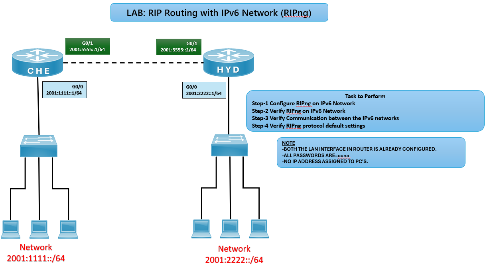

# 🔄 RIPng Routing Lab (CCNA)

## 🎯 Objective

Configure RIPng (Routing Information Protocol for IPv6) between routers and verify dynamic routing, neighbor relationships, and communication across IPv6 networks.

## 🖼️ Lab Topology



# Network Design

| Router | Interface | IPv6 Address     | Connected Network |
|--------|-----------|------------------|-------------------|
| CHE    | G0/0      | 2001:1111::1/64  | 2001:1111::/64    |
| CHE    | G0/1      | 2001:5555::1/64  | WAN Link          |
| HYD    | G0/0      | 2001:2222::1/64  | 2001:2222::/64    |
| HYD    | G0/1      | 2001:5555::2/64  | WAN Link          |

---

## ⚙️ Configuration Steps

```bash

### 🔴 CHE Router
conf t
ipv6 unicast-routing
ipv6 router rip CCNA
exit

interface g0/0
ipv6 address 2001:1111::1/64
ipv6 rip CCNA enable
no shutdown
exit

interface g0/1
ipv6 address 2001:5555::1/64
ipv6 rip CCNA enable
no shutdown
exit

### 🔵 HYD Router
conf t
ipv6 unicast-routing
ipv6 router rip CCNA
exit

interface g0/0
ipv6 address 2001:2222::1/64
ipv6 rip CCNA enable
no shutdown
exit

interface g0/1
ipv6 address 2001:5555::2/64
ipv6 rip CCNA enable
no shutdown
exit

✅ Verification
Check RIPng Neighbors / Updates
debug ipv6 rip
✅ Expected: RIPng update packets exchanged between CHE and HYD.

Check Routing Table
show ipv6 route rip
✅ Expected: Routes should appear with R (RIPng) code.

Test Connectivity
ping 2001:2222::1
ping 2001:1111::1
✅ Successful ping confirms communication across IPv6 networks.

# Common IPv6 RIP Issues and Solutions

| Issue               | Solution                                |
|---------------------|-----------------------------------------|
| No routes learned   | Check `ipv6 rip enable` on interfaces   |
| Wrong routes        | Verify prefix length (`/64`)            |
| No ping             | Ensure interfaces are up                |
| Updates not seen    | Use `debug ipv6 rip`                    |

🌍 Real-World Use Case
Small IPv6 networks needing simple dynamic routing
Lab practice for IPv6 routing protocols
Transition labs for IPv4 → IPv6 migration

🎯 Outcome
Configured RIPng on routers
Verified routing updates and neighbor relationships
Learned dynamic routing behavior with IPv6

