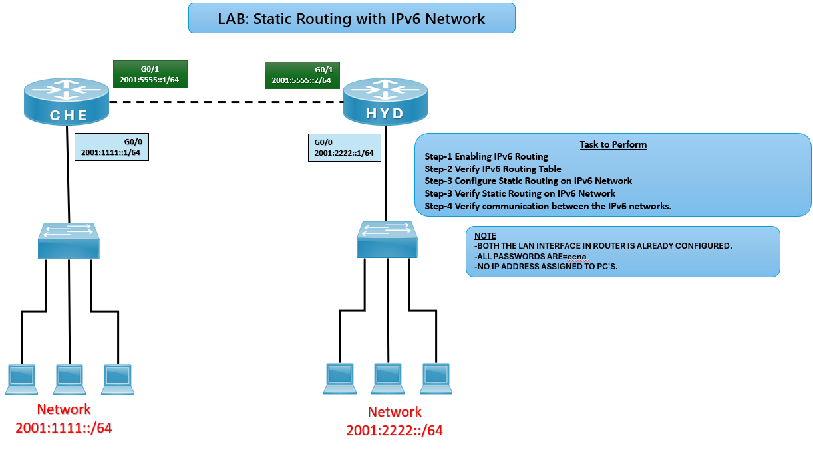

# 📡 Static Routing Lab (IPv6) – CCNA

## 🎯 Objective

Configure static routes between routers in an IPv6 network and verify communication across LANs via the WAN link.

## 🖼️ Lab Topology



# Network Design

| Router | Interface | IPv6 Address     | Connected Network |
|--------|-----------|------------------|-------------------|
| CHE    | G0/0      | 2001:1111::1/64  | 2001:1111::/64    |
| CHE    | G0/1      | 2001:5555::1/64  | WAN Link          |
| HYD    | G0/0      | 2001:2222::1/64  | 2001:2222::/64    |
| HYD    | G0/1      | 2001:5555::2/64  | WAN Link          |

---

## ⚙️ Configuration Steps

```bash

### 🔴 CHE Router
conf t
ipv6 unicast-routing
interface g0/0
ipv6 address 2001:1111::1/64
no shutdown
exit

interface g0/1
ipv6 address 2001:5555::1/64
no shutdown
exit

# Static route to HYD LAN
ipv6 route 2001:2222::/64 2001:5555::2

### 🔵 HYD Router
conf t
ipv6 unicast-routing
interface g0/0
ipv6 address 2001:2222::1/64
no shutdown
exit

interface g0/1
ipv6 address 2001:5555::2/64
no shutdown
exit

# Static route to CHE LAN
ipv6 route 2001:1111::/64 2001:5555::1

✅ Verification
Check Routing Table
show ipv6 route
✅ Expected: Static routes should appear with S (Static) code.

Test Connectivity
ping 2001:2222::1
ping 2001:1111::1
✅ Successful ping confirms communication across IPv6 networks.

# Common IPv6 Static Routing Issues and Solutions

| Issue                | Solution                                |
|----------------------|-----------------------------------------|
| No routes in table   | Verify `ipv6 route` syntax              |
| No ping response     | Check next-hop IPv6 address             |
| Interfaces down      | Use `no shutdown`                       |
| Wrong prefix length  | Ensure `/64` subnet mask applied        |

🌍 Real-World Use Case
Small IPv6 networks without dynamic routing protocols
Backup routes in enterprise networks
Simple WAN connectivity between branch offices

🎯 Outcome
Configured static routes on IPv6 routers
Verified connectivity between LANs via WAN link
Learned manual route setup and troubleshooting