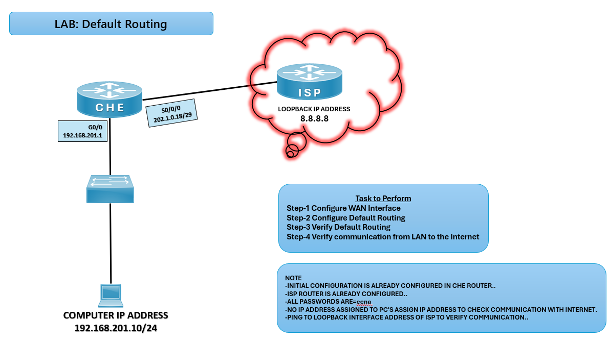

# 🌐 Default Routing Lab (CCNA)

## 🎯 Objective

Configure a default route on the CHE router to forward all unknown traffic towards the ISP router, enabling LAN devices to reach external networks.

## 🖼️ Lab Topology



# Network Design

| Device | Interface  | IP Address        | Connected Network |
|--------|------------|-------------------|-------------------|
| CHE    | G0/0       | 192.168.201.1/24  | LAN               |
| CHE    | S0/0/0     | 202.1.0.18/29     | WAN Link          |
| ISP    | Loopback0  | 8.8.8.8           | Internet Cloud    |
| PC     | NIC        | 192.168.201.10/24 | LAN               |

---

## ⚙️ Configuration Steps

```bash

### 🔴 CHE Router
enable
configure terminal

# Configure LAN interface
interface g0/0
ip address 192.168.201.1 255.255.255.0
no shutdown
exit

# Configure WAN interface
interface s0/0/0
ip address 202.1.0.18 255.255.255.248
no shutdown
exit

# Configure Default Route towards ISP
ip route 0.0.0.0 0.0.0.0 202.1.0.17

exit
write memory

### 💻 PC Configuration
IP Address: 192.168.201.10
Subnet Mask: 255.255.255.0
Default Gateway: 192.168.201.1

✅ Verification
show ip route
✅ Default route (S* 0.0.0.0/0) should be present.

ping 8.8.8.8
✅ Successful ping confirms LAN-to-Internet communication.

# Common IPv4 Static Routing Issues and Solutions

| Issue                  | Solution                                |
|------------------------|-----------------------------------------|
| No default route       | Recheck `ip route` command              |
| PC cannot ping ISP     | Verify PC gateway configuration         |
| Interface down/down    | Use `no shutdown` on CHE WAN            |
| Wrong next-hop address | Ensure ISP WAN IP is correct            |


🌍 Real-World Use Case
Small office/home networks connecting to ISP
Enterprise edge routers forwarding traffic to upstream provider
Simplified routing when only one exit path exists

🎯 Outcome
Configured WAN interface on CHE router
Added default route to ISP
Verified LAN-to-Internet communication via default routing