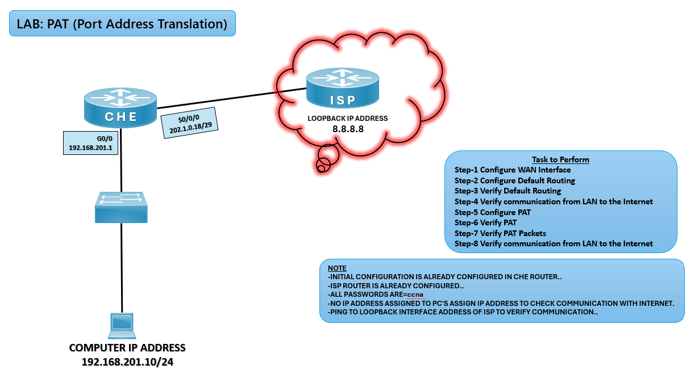

# 🔄 PAT (Port Address Translation) Lab (CCNA)

## 🎯 Objective

Configure PAT (Port Address Translation) on the CHE router to allow multiple LAN devices to access the Internet using a single public IP address.

## 🖼️ Lab Topology



# Network Design

| Device | Interface  | IP Address        | Connected Network |
|--------|------------|-------------------|-------------------|
| CHE    | G0/0       | 192.168.201.1/24  | LAN               |
| CHE    | S0/0/0     | 202.1.0.18/29     | WAN Link          |
| ISP    | Loopback0  | 8.8.8.8           | Internet Cloud    |
| PC     | NIC        | 192.168.201.10/24 | LAN               |

---

## ⚙️ Configuration Steps

```bash

### 🔴 CHE Router
enable
configure terminal

# Configure LAN interface
interface g0/0
ip address 192.168.201.1 255.255.255.0
no shutdown
exit

# Configure WAN interface
interface s0/0/0
ip address 202.1.0.18 255.255.255.248
no shutdown
exit

# Configure Default Route towards ISP
ip route 0.0.0.0 0.0.0.0 202.1.0.17

# Configure PAT
access-list 1 permit 192.168.201.0 0.0.0.255
ip nat inside source list 1 interface s0/0/0 overload

# Define inside/outside interfaces
interface g0/0
ip nat inside
exit

interface s0/0/0
ip nat outside
exit

### 💻 PC Configuration
IP Address: 192.168.201.10  
Subnet Mask: 255.255.255.0  
Default Gateway: 192.168.201.1  

✅ Verification
show ip route
✅ Default route (S* 0.0.0.0/0) should be present.

ping 8.8.8.8
✅ Successful ping confirms LAN-to-Internet communication.

show ip nat translations
✅ Displays active PAT translations.

debug ip nat
✅ Shows real-time NAT translation activity.

# Common IPv4 NAT Issues and Solutions

| Issue                  | Solution                                      |
|------------------------|-----------------------------------------------|
| No NAT translations    | Check access-list and NAT configuration       |
| PC cannot ping ISP     | Verify PC gateway configuration               |
| Interface down/down    | Use `no shutdown` on CHE interfaces           |
| Wrong next-hop address | Ensure ISP WAN IP is correct                  |

🌍 Real-World Use Case
Home and office networks sharing one public IP
Enterprise edge routers connecting multiple users to the Internet
Efficient use of limited public IPv4 addresses

🎯 Outcome
Configured PAT on CHE router
Verified NAT translations and Internet connectivity
Learned how PAT enables multiple devices to share a single public IP