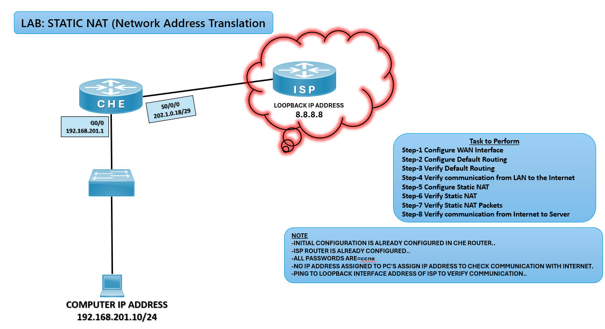

# 🔄 Static NAT Lab (CCNA)

## 🎯 Objective

Configure Static NAT on the CHE router to allow internal devices to be accessed from the Internet using a fixed public IP address.

## 🖼️ Lab Topology



# Network Design

# Device IPv4 Interface Table

| Device | Interface  | IP Address        | Connected Network |
|--------|------------|-------------------|-------------------|
| CHE    | G0/0       | 192.168.201.1/24  | LAN               |
| CHE    | S0/0/0     | 202.1.0.18/29     | WAN Link          |
| ISP    | Loopback0  | 8.8.8.8           | Internet Cloud    |
| PC     | NIC        | 192.168.201.10/24 | LAN               |


---

## ⚙️ Configuration Steps

```bash

### 🔴 CHE Router
enable
configure terminal

# Configure LAN interface
interface g0/0
ip address 192.168.201.1 255.255.255.0
no shutdown
exit

# Configure WAN interface
interface s0/0/0
ip address 202.1.0.18 255.255.255.248
no shutdown
exit

# Configure Default Route towards ISP
ip route 0.0.0.0 0.0.0.0 202.1.0.17

# Configure Static NAT
ip nat inside source static 192.168.201.10 202.1.0.19

# Define inside/outside interfaces
interface g0/0
ip nat inside
exit

interface s0/0/0
ip nat outside
exit

### 💻 PC Configuration
IP Address: 192.168.201.10  
Subnet Mask: 255.255.255.0  
Default Gateway: 192.168.201.1  

✅ Verification
show ip route
✅ Default route (S* 0.0.0.0/0) should be present.

ping 8.8.8.8
✅ Successful ping confirms LAN-to-Internet communication.

show ip nat translations
✅ Displays static NAT mapping.

debug ip nat
✅ Shows NAT packet activity.

# Common IPv4 NAT Issues and Solutions

| Issue                  | Solution                                      |
|------------------------|-----------------------------------------------|
| No NAT mapping         | Check static NAT command syntax               |
| PC cannot ping ISP     | Verify PC gateway configuration               |
| Interface down/down    | Use `no shutdown` on CHE interfaces           |
| Wrong next-hop address | Ensure ISP WAN IP is correct                  |

🌍 Real-World Use Case
Hosting internal servers with fixed public IPs
Allowing external users to access internal services
Enterprise edge routers mapping private to public addresses

🎯 Outcome
Configured Static NAT on CHE router
Verified NAT translations and Internet connectivity
Learned how Static NAT maps private IPs to fixed public IPs