# CCNA v3 Labs Repository

---

## 🚨 Instructions Before Starting CCNA v3 Labs

1. All labs are designed to run **only in Cisco Packet Tracer version 7.0**.  
2. Before starting, disable port labels in Packet Tracer for a cleaner workspace:  
   - Open **Packet Tracer**  
   - Click **Options** from the top menu  
   - Select **Preferences**  
   - Uncheck:  
     - *Show Device Model Labels*  
     - *Show Device Name Labels*  
     - *Always Show Port Labels in Logical Workspace*  
3. In most lab exercises, PCs are not pre‑configured with IP addresses. Assign IP addresses manually according to the lab setup.
4. This folder contains labs demonstrating all the concepts of CCNA Routing & Switching.  
5. Each lab is provided as a `.pkt` file for practice and simulation in Cisco Packet Tracer.
---

### ✅ Thank you, and enjoy your learning journey!

---

---

## 📂 Lab Index
### Initial Router Configuration
- [Initial Router Configuration Lab](IPv4_Router_Configuration/INITIAL_Router_Configuration.pkt)  
[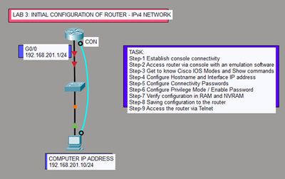](images/IPv4_Router_Configuration/INITIAL_Router_Configuration.png)

### Network Communication (IPv4)
- [Network Communication IPv4 Lab](IPv4_Router_Configuration/Network_Communication_IPv4.pkt)  
[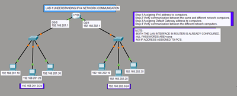](images/IPv4_Router_Configuration/Network_Communication_IPv4.png)

### WAN Serial Interface Configuration
- [WAN Serial Interface Lab](IPv4_Router_Configuration/WAN_SERIAL_Interface_Configuration.pkt)  
[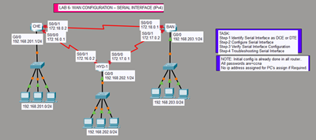](images/IPv4_Router_Configuration/WAN_SERIAL_Interface_Configuration.png)

### Initial Router Configuration (IPv6)
- [Initial Router Configuration Lab](IPv6_Router_Configuration/INITIAL_Router_Configuration_IPv6.pkt)  
[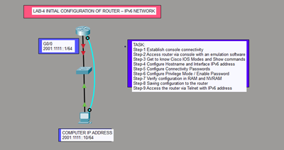](images/IPv6_Router_Configuration/INITIAL_Router_Configuration_IPv6.png)

### Network Communication (IPv6)
- [Network Communication IPv6 Lab](IPv6_Router_Configuration/Network_Communication_IPv6.pkt)  
[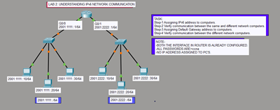](images/IPv6_Router_Configuration/Network_Communication_IPv6.png)

### WAN Interface Configuration (IPv6)
- [WAN Interface IPv6 Lab](IPv6_Router_Configuration/WAN_Interface_Configuration_IPv6.pkt)  
[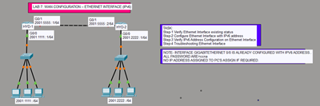](images/IPv6_Router_Configuration/WAN_Interface_Configuration_IPv6.png)

### Static Routing
- [Static Routing Lab](IPv4_Routing/StaticRouting.pkt)  

### RIP
- [RIP Lab](IPv4_Routing/RIP.pkt)  

### OSPF
- [OSPF Lab](IPv4_Routing/OSPF.pkt)  

### OSPF Multi-Area
- [OSPF Multi-Area Lab](IPv4_Routing/OSPF_MultiArea.pkt)  

### EIGRP
- [EIGRP Lab](IPv4_Routing/EIGRP.pkt)  

### BGP
- [BGP Lab](IPv4_Routing/BGP.pkt)  

### Static Routing (IPv6)
- [Static Routing Lab](IPv6_Routing/StaticRouting_IPv6.pkt)  

### RIPng (IPv6)
- [RIPng Lab](IPv6_Routing/RIP_IPv6.pkt)  

### OSPFv3 (IPv6)
- [OSPFv3 Lab](IPv6_Routing/OSPF_IPv6.pkt)  

### EIGRP for IPv6
- [EIGRP IPv6 Lab](IPv6_Routing/EIGRP_IPv6.pkt)  

### Standard ACL (IPv4 – Named)
- [Standard ACL IPv4 Named Lab](Router_Security/ACCESS_CONTROL_LIST_STANDARD_IPv4_NAMED.pkt)  
[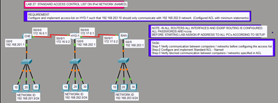](images/Router_Security/ACCESS_CONTROL_LIST_STANDARD_IPv4_NAMED.png)

### Standard ACL (IPv4 – Numbered)
- [Standard ACL IPv4 Numbered Lab](Router_Security/ACCESS_CONTROL_LIST_STANDARD_IPv4_NUMBERED.pkt)  
[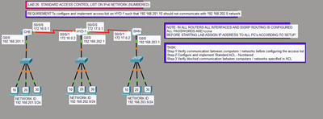](images/Router_Security/ACCESS_CONTROL_LIST_STANDARD_IPv4_NUMBERED.png)

### Extended ACL (IPv4 – Numbered)
- [Extended ACL IPv4 Numbered Lab](Router_Security/ACCESS_CONTROL_LIST_EXTENDED_IPv4_NUMBERED.pkt)  
[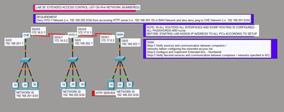](images/Router_Security/ACCESS_CONTROL_LIST_EXTENDED_IPv4_NUMBERED.png)

### Extended ACL (IPv4 – Named)
- [Extended ACL IPv4 Named Lab](Router_Security/ACCESS_CONTROL_LIST_EXTENDED_IPv4_NAMED.pkt)  
[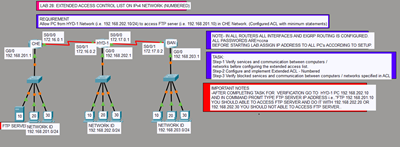](images/Router_Security/ACCESS_CONTROL_LIST_EXTENDED_IPv4_NAMED.png)

### ACL (IPv6)
- [ACL IPv6 Lab](Router_Security/ACCESS_CONTROL_LIST_IPv6.pkt)  
[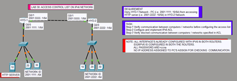](images/Router_Security/ACCESS_CONTROL_LIST_IPv6.png)

### Basic Router Security
- [Basic Router Security Lab](Router_Security/BASIC_ROUTER_SECURITY.pkt)  
[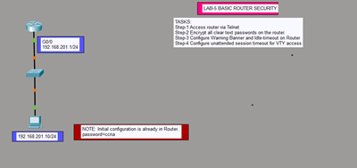](images/Router_Security/BASIC_ROUTER_SECURITY.png)

### Enhancing Router Security
- [Enhancing Router Security Lab](Router_Security/ENHANCING_ROUTER_SECURITY.pkt)  
[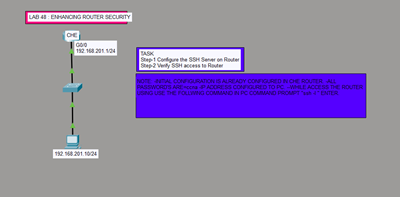](images/Router_Security/ENHANCING_ROUTER_SECURITY.png)

### IOS Licensing
- [IOS Licensing Lab](Router_Security/IOS_LICENSING.pkt)  
[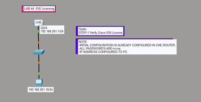](images/Router_Security/IOS_LICENSING.png)

### PPP Authentication
- [PPP Authentication Lab](Router_Security/PPP_AUTHENTICATION.pkt)  
[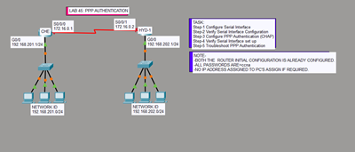](images/Router_Security/PPP_AUTHENTICATION.png)

### Router Password Recovery
- [Router Password Recovery Lab](Router_Security/ROUTER_PASSWORD_RECOVERY.pkt)  
[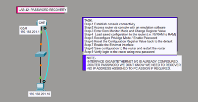](images/Router_Security/ROUTER_PASSWORD_RECOVERY.png)

### VPN (GRE)
- [VPN GRE Lab](Router_Security/VPN(GRE).pkt)  
[_thumb.png)](images/Router_Security/VPN(GRE).png)

### Default Routing
- [Default Routing Lab](NAT/DEFAULT_ROUTING.pkt)  
[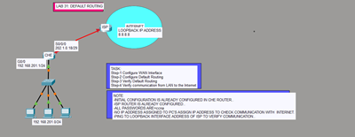](images/NAT/DEFAULT_ROUTING.png)

### Static NAT
- [Static NAT Lab](NAT/STATIC_NAT.pkt)  
[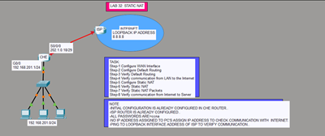](images/NAT/STATIC_NAT.png)

### Port Address Translation (PAT)
- [PAT Lab](NAT/PORT_ADDRESS_TRANSLATION_(PAT).pkt)  
[_thumb.png)](images/NAT/PORT_ADDRESS_TRANSLATION_(PAT).png)

### IOS Backup with TFTP & FTP
- [IOS Backup Lab](IOS_Backup/IOS_Backup_with_TFTP&FTP.pkt)  

### DHCP Server & Client
- [DHCP Lab](Router_Services/DHCP_SERVER_CLIENT.pkt)  
[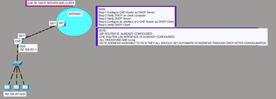](images/Router_Services/DHCP_SERVER_CLIENT.png)

### Network Time Protocol (NTP)
- [NTP Lab](Router_Services/NETWORK_TIME_PROTOCOL_NTP.pkt)  
[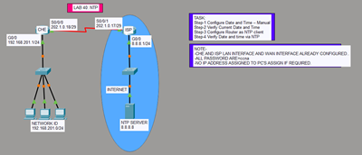](images/Router_Services/NETWORK_TIME_PROTOCOL_NTP.png)

### Syslog
- [Syslog Lab](Router_Services/SYSLOG.pkt)  
[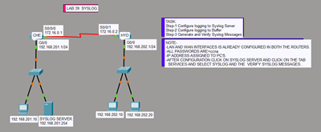](images/Router_Services/SYSLOG.png)

### Switch Initial Configuration
- [Switch Initial Configuration Lab](Switching/SWITCH_INITIAL_CONFIGURATION.pkt)  
[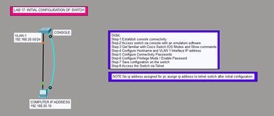](images/Switching/SWITCH_INITIAL_CONFIGURATION.png)

### VLANs Trunking
- [VLANs Trunking Lab](Switching/VLANs_TRUNKING.pkt)  
[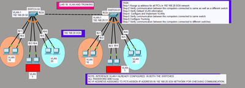](images/Switching/VLANs_TRUNKING.png)

### VLAN Trunking Protocol (VTP)
- [VTP Lab](Switching/VLAN_TRUNKING_PROTOCOL_VTP.pkt)  
[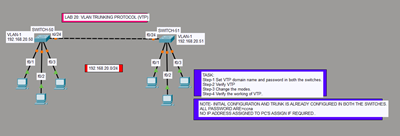](images/Switching/VLAN_TRUNKING_PROTOCOL_VTP.png)

### Router on a Stick (Inter-VLAN Routing)
- [Router on a Stick Lab](Switching/ROUTER_ON_A_STICK_INTER_VLAN_ROUTING.pkt)  
[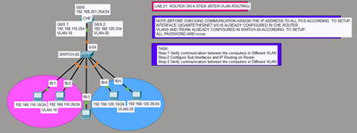](images/Switching/ROUTER_ON_A_STICK_INTER_VLAN_ROUTING.png)

### Spanning Tree Protocol (STP)
- [STP Lab](Switching/SPANNING_TREE_PROTOCOL_STP.pkt)  
[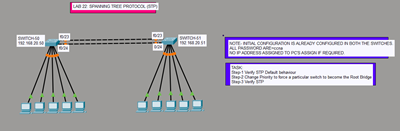](images/Switching/SPANNING_TREE_PROTOCOL_STP.png)

### PortFast & BPDU Guard
- [PortFast & BPDU Guard Lab](Switching/PORTFAST_BPDU_GUARD.pkt)  
[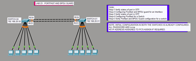](images/Switching/PORTFAST_BPDU_GUARD.png)

### Port Security
- [Port Security Lab](Switching/PORT_SECURITY.pkt)  
[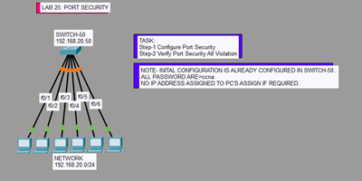](images/Switching/PORT_SECURITY.png)

### EtherChannel
- [EtherChannel Lab](Switching/ETHERCHANNEL.pkt)  
[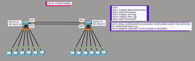](images/Switching/ETHERCHANNEL.png)

### Cisco Discovery Protocol (CDP)
- [CDP Lab](Switching/CISCO_DISCOVERY_PROTOCOL_CDP.pkt)  
[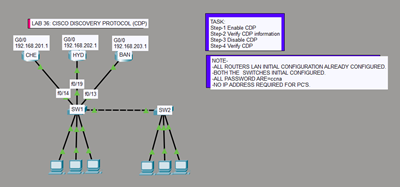](images/Switching/CISCO_DISCOVERY_PROTOCOL_CDP.png)

### Dynamic Trunking Protocol (DTP)
- [DTP Lab](Switching/DYNAMIC_TRUNKING_PROTOCOL_DTP.pkt)  
[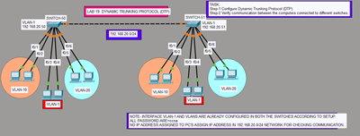](images/Switching/DYNAMIC_TRUNKING_PROTOCOL_DTP.png)

---

## 📝 Notes
- All labs are designed for **IPv4 networks**.
- File names and image names are standardized for consistency.
- Click the thumbnail to view the **full topology diagram**.
- Open `.pkt` files directly in **Cisco Packet Tracer** to run the simulations.
