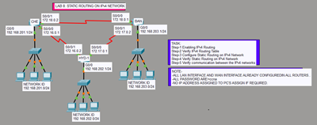

## 📘 Static Routing Lab

🔹 Manual routing configuration between routers.

### 🔗 Quick Access
- 📄 [Lab Manual](IPv4_Routing/STATIC_Routing/README.md)
- 🧪 [Download PKT](IPv4_Routing/STATIC_Routing/STATIC_Routing.pkt)
- 🖼️ [View Topology](IPv4_Routing/STATIC_Routing/STATIC_Routing.png)

### 🖼️ Preview

✅ **Covers:** Static routing, verification, troubleshooting