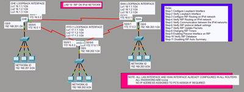
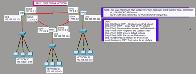
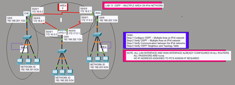
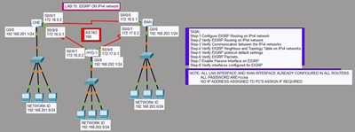
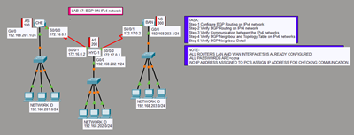
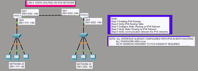
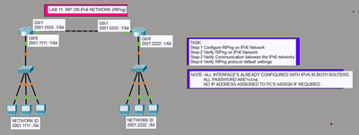
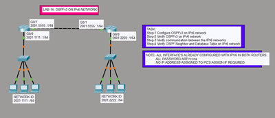
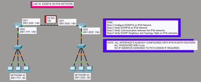
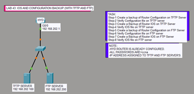

# Cisco Packet Tracer Labs – IPv4 Routing

This folder contains labs demonstrating different IPv4 routing protocols and techniques.  
Each lab is provided as a `.pkt` file for practice and simulation in Cisco Packet Tracer.

---

## 📂 Lab Index

### Static Routing
- [Static Routing Lab](IPv4_Routing/StaticRouting.pkt)  

### RIP
- [RIP Lab](IPv4_Routing/RIP.pkt)  

### OSPF
- [OSPF Lab](IPv4_Routing/OSPF.pkt)  

### OSPF Multi-Area
- [OSPF Multi-Area Lab](IPv4_Routing/OSPF_MultiArea.pkt)  

### EIGRP
- [EIGRP Lab](IPv4_Routing/EIGRP.pkt)  

### BGP
- [BGP Lab](IPv4_Routing/BGP.pkt)  

### Static Routing (IPv6)
- [Static Routing Lab](IPv6_Routing/StaticRouting_IPv6.pkt)  

### RIPng (IPv6)
- [RIPng Lab](IPv6_Routing/RIP_IPv6.pkt)  

### OSPFv3 (IPv6)
- [OSPFv3 Lab](IPv6_Routing/OSPF_IPv6.pkt)  

### EIGRP for IPv6
- [EIGRP IPv6 Lab](IPv6_Routing/EIGRP_IPv6.pkt)  

### IOS Backup with TFTP & FTP
- [IOS Backup Lab](IOS_Backup/IOS_Backup_with_TFTP&FTP.pkt)  

---

## 📝 Notes
- All labs are designed for **IPv4 networks**.
- File names and image names are standardized for consistency.
- Click the thumbnail to view the **full topology diagram**.
- Open `.pkt` files directly in **Cisco Packet Tracer** to run the simulations.
