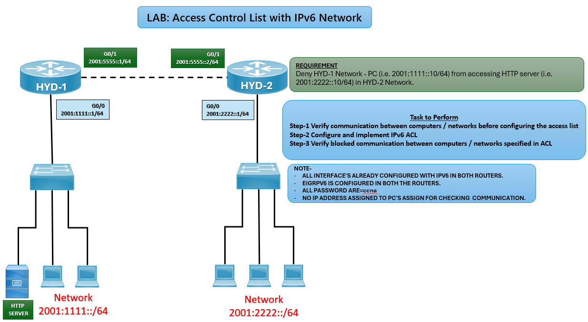

# 🔒 IPv6 Access Control List Lab (CCNA)

## 🎯 Objective

Configure and apply an IPv6 ACL to block specific traffic between two networks while allowing other communication.

## 🖼️ Lab Topology



# Router IPv6 Interface Table

| Router | Interface | IPv6 Address     | Connected Network       |
|--------|-----------|------------------|-------------------------|
| HYD-1  | G0/0      | 2001:1111::1/64  | LAN (PCs + Server)      |
| HYD-1  | G0/1      | 2001:5555::1/64  | WAN Link                |
| HYD-2  | G0/0      | 2001:2222::1/64  | LAN (PCs)               |
| HYD-2  | G0/1      | 2001:5555::2/64  | WAN Link                |

---

## ⚙️ Configuration Steps

```bash

### 🔴 HYD-1 Router
enable
configure terminal

# LAN interface
interface g0/0
ipv6 address 2001:1111::1/64
no shutdown
exit

# WAN interface
interface g0/1
ipv6 address 2001:5555::1/64
no shutdown
exit

### 🔵 HYD-2 Router
enable
configure terminal

# LAN interface
interface g0/0
ipv6 address 2001:2222::1/64
no shutdown
exit

# WAN interface
interface g0/1
ipv6 address 2001:5555::2/64
no shutdown
exit

# Configure IPv6 ACL to block HTTP traffic
ipv6 access-list BLOCK_HTTP
 deny tcp host 2001:1111::10 host 2001:2222::10 eq 80
 permit ipv6 any any
exit

# Apply ACL inbound on LAN interface
interface g0/0
ipv6 traffic-filter BLOCK_HTTP in
exit

### 💻 PC Configuration
HYD-1 PC: 2001:1111::10/64, Gateway: 2001:1111::1  
HYD-2 Server: 2001:2222::10/64, Gateway: 2001:2222::1  

✅ Verification
ping 2001:2222::10
✅ Should succeed (basic connectivity).

telnet 2001:2222::10 80
❌ Should fail (HTTP blocked by ACL).

show ipv6 access-list
✅ Displays ACL entries and hit counts.

# Common IPv6 ACL Issues and Solutions

| Issue             | Solution                                         |
|-------------------|--------------------------------------------------|
| ACL not blocking  | Verify correct source/destination addresses      |
| Connectivity lost | Ensure `permit ipv6 any any` is included         |
| No ACL hits       | Confirm ACL applied to correct interface         |

🌍 Real-World Use Case
Blocking specific applications (e.g., HTTP) between networks
Enforcing IPv6 security policies
Controlling access between branch offices

🎯 Outcome
Configured IPv6 ACL on HYD-2 router
Verified blocked HTTP traffic from HYD-1 PC to HYD-2 server
Ensured other communication remains functional