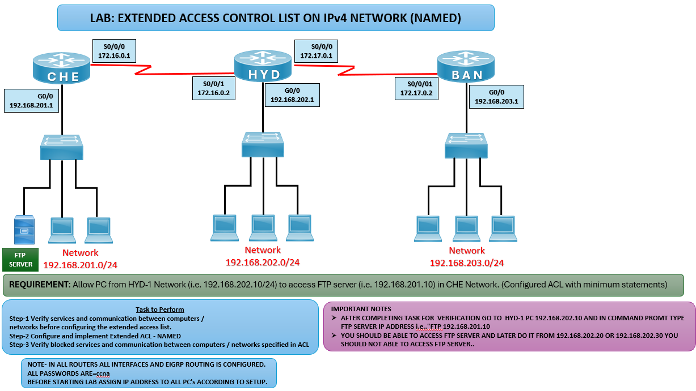

# 🔒 Extended ACL (Named) Lab – IPv4

## 🎯 Objective

Configure and apply a Named Extended ACL to allow only a specific PC from the HYD network to access the FTP server in the CHE network, while blocking other PCs.

## 🖼️ Lab Topology

# Router IPv4 Interface Table

| Router   | Interface | IP Address              | Connected Network   |
|----------|-----------|-------------------------|---------------------|
| CHE      | LAN       | 192.168.201.1/24        | FTP Server LAN      |
| HYD      | LAN       | 192.168.202.1/24        | HYD PCs LAN         |
| BAN      | LAN       | 192.168.203.1/24        | BAN PCs LAN         |
| CHE ↔ HYD| S0/0/0    | 172.16.0.1 / 172.16.0.2 | WAN Link            |
| HYD ↔ BAN| S0/0/1    | 172.17.0.1 / 172.17.0.2 | WAN Link            |

---

## ⚙️ Configuration Steps

### 🔴 HYD Router

enable  
configure terminal

**Create Named Extended ACL**  
ip access-list extended FTP_ACCESS  
 permit tcp host 192.168.202.10 host 192.168.201.10 eq ftp  
 deny tcp 192.168.202.0 0.0.0.255 host 192.168.201.10 eq ftp  
 permit ip any any  
exit

**Apply ACL outbound towards CHE**  
interface s0/0/0  
ip access-group FTP_ACCESS out  
exit

### 💻 PC Configuration
HYD-1 PC: **192.168.202.10**, Gateway: **192.168.202.1**  
HYD-2 PC: **192.168.202.20**, Gateway: **192.168.202.1**  
HYD-3 PC: **192.168.202.30**, Gateway: **192.168.202.1**  
CHE FTP Server: **192.168.201.10**, Gateway: **192.168.201.1**  

## ✅ Verification
**Test Connectivity**  
ping 192.168.201.10

**Expected: ✅ All PCs should be able to ping the FTP server (basic connectivity).*

**Check FTP Access**  
ftp 192.168.201.10  

**Expected: ✅ Only 192.168.202.10 should successfully connect to the FTP server.  
❌ Other HYD PCs (192.168.202.20, 192.168.202.30) should be denied.*

**Verify Access List**  
show access-lists

**Expected: ✅ Displays ACL entries and hit counts.*

## Common IPv4 ACL Issues and Solutions

| Issue             | Solution                                                   |
|-------------------|------------------------------------------------------------|
| ACL not working   | Verify ACL applied to correct interface                    |
| All PCs blocked   | Ensure permit statement for `192.168.202.10` is first      |
| No ACL hits       | Confirm traffic is matching ACL (FTP port 21)              |

## 🌍 Real-World Use Case
- Restricting access to servers based on specific hosts
- Enforcing security policies in enterprise networks
- Controlling application-level traffic (FTP, HTTP, etc.)

## 🎯 Outcome
- Configured Named Extended ACL on HYD router
- Allowed only HYD-1 PC to access FTP server in CHE network
- Blocked other HYD PCs from accessing FTP server
- Verified ACL functionality with FTP tests

---
## 🙏 Acknowledgment
- This lab guide is part of the CCNA practice series. Thank you for following along and building your skills in networking.

---
## ✍️ Author's Note
- Prepared and documented by **Sandeep Gaikwad** for CCNA lab practice and GitHub repository organization.

---
## ✅ Closing
- Thank you for reviewing this lab manual. Keep practicing consistently — networking mastery comes with hands-on repetition.
