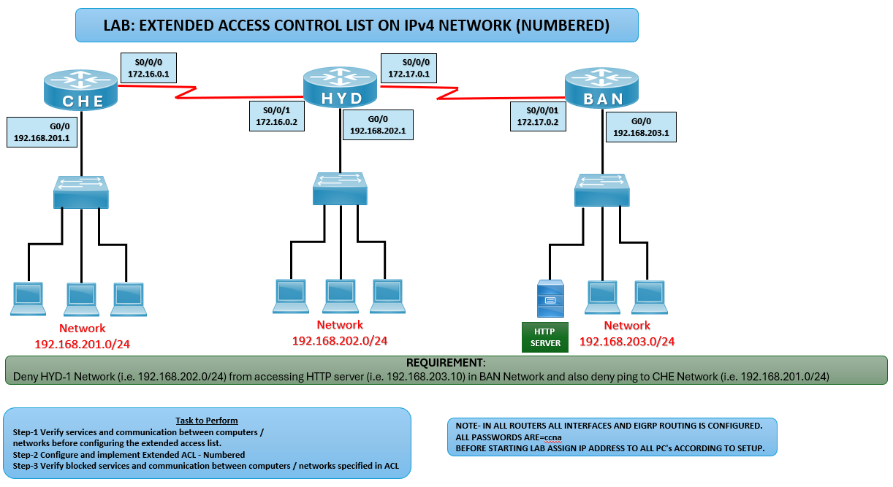

# 🔒 Extended ACL (Numbered) Lab – IPv4

## 🎯 Objective
Configure and apply a Numbered Extended ACL to:

Deny HYD network (192.168.202.0/24) from accessing the HTTP server in BAN network (192.168.203.10).

Deny HYD network from pinging CHE network (192.168.201.0/24).

## 🖼️ Lab Topology



# Router IPv4 Interface Table

| Router | Interface | IP Address       | Connected Network        |
|--------|-----------|------------------|--------------------------|
| CHE    | G0/0      | 192.168.201.1/24 | CHE LAN                  |
| CHE    | S0/0/0    | 172.16.0.1       | WAN to HYD               |
| HYD    | G0/0      | 192.168.202.1/24 | HYD LAN                  |
| HYD    | S0/0/1    | 172.16.0.2       | WAN to CHE               |
| HYD    | S0/0/0    | 172.17.0.1       | WAN to BAN               |
| BAN    | G0/0      | 192.168.203.1/24 | BAN LAN (HTTP Server)    |
| BAN    | S0/0/1    | 172.17.0.2       | WAN to HYD               |

---

## ⚙️ Configuration Steps

```bash

### 🔴 HYD Router
enable
configure terminal

# Create Numbered Extended ACL
access-list 110 deny tcp 192.168.202.0 0.0.0.255 host 192.168.203.10 eq 80
access-list 110 deny icmp 192.168.202.0 0.0.0.255 192.168.201.0 0.0.0.255
access-list 110 permit ip any any

# Apply ACL outbound towards BAN
interface s0/0/0
ip access-group 110 out
exit

# Apply ACL outbound towards CHE
interface s0/0/1
ip access-group 110 out
exit

### 💻 PC Configuration
HYD PCs: 192.168.202.x, Gateway: 192.168.202.1  
CHE PCs: 192.168.201.x, Gateway: 192.168.201.1  
BAN HTTP Server: 192.168.203.10, Gateway: 192.168.203.1  

✅ Verification
ping 192.168.201.10
❌ HYD PCs should be denied (ICMP blocked).

telnet 192.168.203.10 80
❌ HYD PCs should be denied (HTTP blocked).

ping 192.168.203.10
✅ HYD PCs should still be able to ping BAN server (ICMP allowed unless explicitly denied).

show access-lists
✅ Displays ACL entries and hit counts.

# Common IPv4 ACL Issues and Solutions

| Issue               | Solution                                         |
|---------------------|--------------------------------------------------|
| ACL not blocking    | Verify correct source/destination addresses      |
| All traffic blocked | Ensure `permit ip any any` is included           |
| No ACL hits         | Confirm ACL applied to correct interface         |

🌍 Real-World Use Case
Restricting access to specific services (HTTP, FTP, etc.)
Enforcing security policies between branch networks
Controlling ICMP traffic to prevent unnecessary pings

🎯 Outcome
Configured Numbered Extended ACL on HYD router
Denied HYD PCs from accessing BAN HTTP server
Denied HYD PCs from pinging CHE network
Verified ACL functionality with service-specific tests
