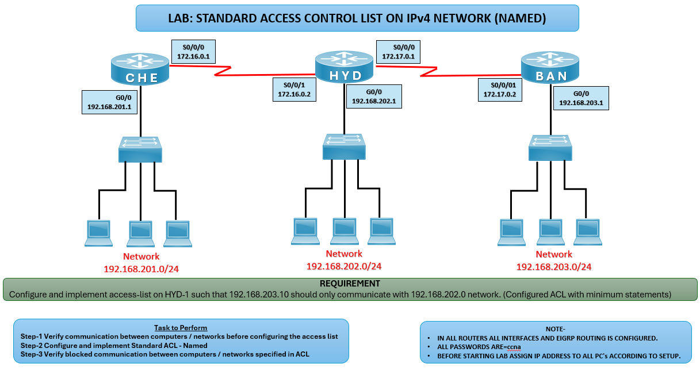

# 🔒 Standard ACL (Named) Lab – IPv4

## 🎯 Objective

Configure and apply a Named Standard ACL on HYD router so that only host 192.168.203.10 can communicate with the 192.168.202.0/24 network, while other hosts are denied.

## 🖼️ Lab Topology

# Router IPv4 Interface Table

| Router | Interface | IP Address       | Connected Network     |
|--------|-----------|------------------|-----------------------|
| CHE    | G0/0      | 192.168.201.1/24 | CHE LAN               |
| CHE    | S0/0/0    | 172.16.0.1       | WAN to HYD            |
| HYD    | G0/0      | 192.168.202.1/24 | HYD LAN               |
| HYD    | S0/0/1    | 172.16.0.2       | WAN to CHE            |
| HYD    | S0/0/0    | 172.17.0.1       | WAN to BAN            |
| BAN    | G0/0      | 192.168.203.1/24 | BAN LAN (HTTP Server) |
| BAN    | S0/0/1    | 172.17.0.2       | WAN to HYD            |

---

## ⚙️ Configuration Steps

### 🔴 HYD Router
enable  
configure terminal

**Create Named Standard ACL**  
ip access-list standard BAN_TO_HYD  
 permit host 192.168.203.10  
 deny any  
exit

**Apply ACL inbound on HYD LAN interface**  
interface g0/0  
ip access-group BAN_TO_HYD in  
exit

### 💻 PC Configuration
HYD PCs: **192.168.202.x**, Gateway: **192.168.202.1**  
BAN Host: **192.168.203.10**, Gateway: **192.168.203.1**  
Other BAN PCs: **192.168.203.x**, Gateway: **192.168.203.1**  

## ✅ Verification
**Test Connectivity**  
ping 192.168.202.10

**Expected:  
✅ From 192.168.203.10 → Should succeed.  
❌ From other BAN PCs → Should fail.*

**Check Access List**  
show access-lists

**Expected: ✅ Displays ACL entries and hit counts.*

## Common IPv4 ACL Issues and Solutions

| Issue             | Solution                                                   |
|-------------------|------------------------------------------------------------|
| ACL not working   | Verify ACL applied to correct interface                    |
| All traffic blocked | Ensure correct permit statement for `192.168.203.10`     |
| No ACL hits       | Confirm traffic is matching ACL (check direction)          |

## 🌍 Real-World Use Case
- Restricting access so only a specific host can reach a network
- Enforcing host-level security policies
- Simplifying access control with minimal ACL statements

## 🎯 Outcome
- Configured Named Standard ACL on HYD router
Allowed only BAN host (192.168.203.10) to communicate with HYD network
- Denied other BAN hosts from accessing HYD network
- Verified ACL functionality with ping tests

---
## 🙏 Acknowledgment
This lab guide is part of the CCNA practice series. Thank you for following along and building your skills in networking.

---
## ✍️ Author's Note
Prepared and documented by Sandeep Gaikwad for CCNA lab practice and GitHub repository organization.

---
## ✅ Closing
Thank you for reviewing this lab manual. Keep practicing consistently — networking mastery comes with hands-on repetition.
