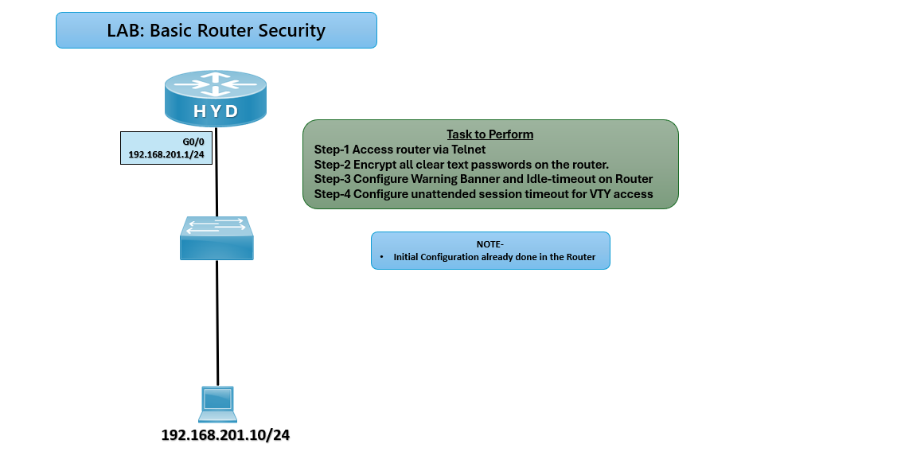

# 🔐 Basic Router Security Lab – CCNA

## 🎯 Objective

Secure router access by configuring password encryption, warning banners, idle-timeout, and unattended session timeout for VTY access.

## 🖼️ Lab Topology



---

## ⚙️ Configuration Steps

```bash

### 🔴 HYD Router
enable
configure terminal

# Step 1: Configure Telnet Access
line vty 0 4
password ccna
login
exit

# Step 2: Encrypt all clear text passwords
service password-encryption

# Step 3: Configure Warning Banner
banner motd ^C
Unauthorized access is prohibited!
^C

# Step 4: Configure Idle Timeout for Console
line console 0
exec-timeout 5 0
exit

# Step 5: Configure Unattended Session Timeout for VTY
line vty 0 4
exec-timeout 10 0
exit

✅ Verification
telnet 192.168.201.1
✅ Router should prompt for password.

show running-config
✅ Passwords should appear encrypted.

# Idle timeout test
Leave console/VTY session idle → should disconnect after configured time.

# Common Telnet and Line Configuration Issues and Solutions

| Issue                 | Solution                                               |
|-----------------------|--------------------------------------------------------|
| Telnet not working    | Verify IP connectivity and VTY configuration           |
| Password not encrypted| Ensure `service password-encryption` is enabled        |
| Timeout not applied   | Check `exec-timeout` values on console/VTY lines       |

🌍 Real-World Use Case
Prevent unauthorized router access
Protect passwords from being stored in clear text
Enforce session timeouts to reduce risk of unattended access

🎯 Outcome
Configured Telnet access with password protection
Encrypted all router passwords
Applied warning banner for legal compliance
Configured idle-timeout and unattended session timeout for security

---
## 🙏 Acknowledgment
This lab guide is part of the CCNA practice series. Thank you for following along and building your skills in networking.

---
## ✍️ Author's Note
Prepared and documented by Sandeep Gaikwad for CCNA lab practice and GitHub repository organization.

---
## ✅ Closing
Thank you for reviewing this lab manual. Keep practicing consistently — networking mastery comes with hands-on repetition.
