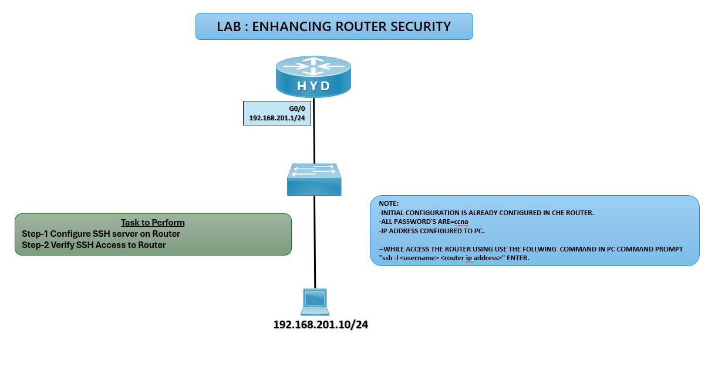

# 🔐 Enhancing Router Security Lab – SSH

## 🎯 Objective

Configure SSH access on the HYD router to secure remote management and verify connectivity from a PC.

## 🖼️ Lab Topology

# 🔴 HYD Router
enable  
configure terminal  

### Step 1: Configure hostname and domain  
hostname HYD  
ip domain-name ccna-lab.com  

### Step 2: Generate RSA keys for SSH
crypto key generate rsa  
1024  

**Step 3: Create local user for SSH**
username admin privilege 15 secret ccna

### Step 4: Configure VTY lines for SSH
line vty 0 4
transport input ssh
login local
exit

### Step 5: Enable SSH version 2
ip ssh version 2

## ✅ Verification
ssh -l admin 192.168.201.1
✅ Router should prompt for password and allow secure login.

show ip ssh
✅ Confirms SSH is enabled and running.

show running-config
Verify SSH configuration, user account, and RSA keys.

## Common SSH Issues and Solutions

| Issue                | Solution                                               |
|----------------------|--------------------------------------------------------|
| SSH not connecting   | Verify RSA keys generated and SSH enabled              |
| Login fails          | Check username/password configuration                  |
| Still allows Telnet  | Ensure `transport input ssh` is set on VTY lines       |

## 🌍 Real-World Use Case
Secure router management using encrypted sessions
Prevent unauthorized access via Telnet
Enforce best practices in enterprise network security

## 🎯 Outcome
Configured SSH server on HYD router
Verified secure remote login from PC
Ensured encrypted communication for router management

---
## 🙏 Acknowledgment
This lab guide is part of the CCNA practice series. Thank you for following along and building your skills in networking.

---
## ✍️ Author's Note
Prepared and documented by Sandeep Gaikwad for CCNA lab practice and GitHub repository organization.

---
## ✅ Closing
Thank you for reviewing this lab manual. Keep practicing consistently — networking mastery comes with hands-on repetition.
