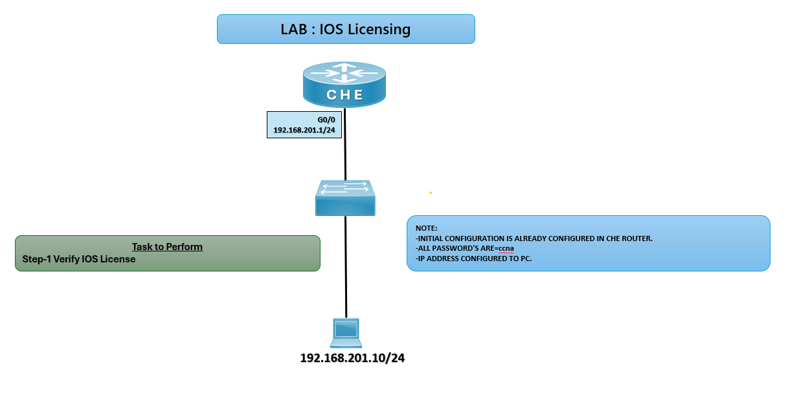

# 🔑 LAB: IOS Licensing

## 🎯 Objective

Verify and understand Cisco IOS licensing on a router.

Learn how to check license status and features.

Practice basic license verification commands.

## 🖼️ Lab Topology

# Initial Lab Setup

| Device     | Interface | IP Address        | Notes                     |
|------------|-----------|-------------------|---------------------------|
| Router CHE | G0/0      | 192.168.201.1/24  | Initial config pre‑done   |
| Switch     | —         | —                 | Connected to CHE router   |
| PC         | NIC       | 192.168.201.10/24 | Passwords = `ccna`        |

## ⚙️ Configuration Steps
**Note: Initial configuration is already done on CHE router. Passwords are set to ccna.**

## CHE Router

**Verify IOS License**  
show license  
show version

**✅ Expected: Displays license information (status, type, expiry).*

**Verify IOS Version**  
show version

**Expected: ✅ Expected: Confirms IOS image, feature set, and license details.*

### ⚠️ Troubleshooting (Common Issues and Solutions)

| Issue                 | Solution                                               |
|------------------------|--------------------------------------------------------|
| License not visible    | Ensure correct IOS image is installed                  |
| Invalid license error  | Verify license file and reload router                  |
| Features not enabled   | Check license level (IP Base, Security, etc.)          |

## 🌍 Real-World Use Case
- Enterprise routers requiring advanced features
- Feature activation (e.g., Security, Voice, Data)
- Compliance tracking for audits
- Smart Licensing in modern deployments

## ✅ Outcome
- Verified IOS license on CHE router
- Understood license types and feature sets
- Practiced show commands for license verification
- Learned real-world relevance of IOS licensing

---
## 🙏 Acknowledgment
- This lab guide is part of the CCNA practice series. Thank you for following along and building your skills in networking.

---
## ✍️ Author's Note
- Prepared and documented by **Sandeep Gaikwad** for CCNA lab practice and GitHub repository organization.

---
## ✅ Closing
- Thank you for reviewing this lab manual. Keep practicing consistently — networking mastery comes with hands-on repetition.