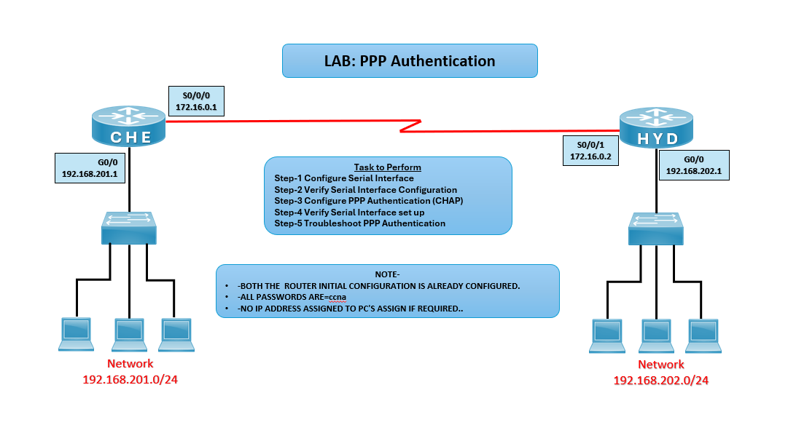

# 🔐 LAB: PPP Authentication

## 🎯 Objective

- Configure and verify PPP encapsulation on serial links.  
- Implement CHAP authentication between routers.  
- Troubleshoot PPP authentication issues.

## 🖼️ Lab Topology

--- 
## Device Interface Table

| Device        | Interface | IP Address        | Notes                                |
|---------------|-----------|-------------------|--------------------------------------|
| Router CHE    | G0/0      | 192.168.201.1/24  | Connected to LAN (Switch + PCs)      |
| Router CHE    | S0/0/0    | 172.16.0.1/30     | Serial link to HYD                   |
| Router HYD    | G0/0      | 192.168.202.1/24  | Connected to LAN (Switch + PCs)      |
| Router HYD    | S0/0/1    | 172.16.0.2/30     | Serial link to CHE 

## ⚙️ Configuration Steps

### CHE Router

**Configure Serial Interface with PPP Encapsulation**  
interface s0/0/0  
ip address 172.16.0.1 255.255.255.252  
encapsulation **ppp**  
no shutdown  

### HYD Router

**Configure Serial Interface with PPP Encapsulation**  
interface s0/0/1  
ip address 172.16.0.2 255.255.255.252  
encapsulation ppp  
no shutdown

## Configure PPP Authentication on CHE Router
username HYD password ccna  
interface s0/0/0  
ppp authentication chap

## Configure PPP Authentication on HYD Router
username CHE password ccna  
interface s0/0/1  
ppp authentication chap

## Verification
**Verify Serial Interface Setup on both the Routers**  
show interface s0/0/0  

**Expected: Should able to see Serial IP*

**Debug PPP Authentication on both the Routers**  
debug ppp authentication  

**Expected: Should able to see Authentication packets are exchanging between Routers*

## ⚠️ Troubleshooting
# WAN / PPP Troubleshooting Guide

| Issue                  | Solution                                      |
|-------------------------|-----------------------------------------------|
| Serial interface down   | Check cable and use `no shutdown`             |
| PPP not working         | Verify encapsulation is set to PPP            |
| Authentication failed   | Ensure usernames and passwords match          |
| PCs not communicating   | Assign correct IP addresses to NICs           |

## 🌍 Real-World Use Case
- WAN connectivity between branch routers
- Secure point-to-point links using CHAP authentication
- Legacy WAN technologies in enterprise networks
- Backup links for redundancy

## ✅ Outcome
- Configured PPP encapsulation on serial interfaces
- Implemented CHAP authentication between CHE and HYD routers
- Verified serial connectivity and authentication success
- Learned troubleshooting techniques for PPP links

---
## 🙏 Acknowledgment
- This lab guide is part of the CCNA practice series. Thank you for following along and building your skills in networking.

---
## ✍️ Author's Note
- Prepared and documented by **Sandeep Gaikwad** for CCNA lab practice and GitHub repository organization.

---
## ✅ Closing
- Thank you for reviewing this lab manual. Keep practicing consistently — networking mastery comes with hands-on repetition.