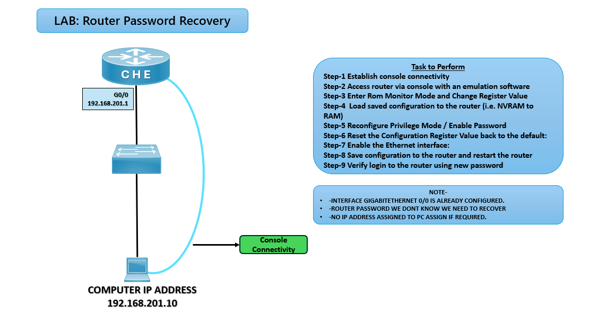

# 🔑 LAB: Router Password Recovery

## 🎯 Objective

- Recover lost or unknown router passwords.
- Use ROM Monitor mode to bypass and reset configuration register.
- Restore router access and reconfigure enable password.

## 🖼️ Lab Topology

# Initial Lab Setup

| Device     | Interface | IP Address        | Notes                          |
|------------|-----------|-------------------|--------------------------------|
| Router CHE | G0/0      | 192.168.201.1/24  | Already configured             |
| PC         | NIC       | 192.168.201.10/24 | Console connectivity to router |
| Console    | —         | —                 | Used for password recovery     |

## ⚙️ Configuration Steps

**Step 1: Establish Console Connectivity**  
Connect PC to router CHE via console cable.  
Use terminal emulator (e.g., PuTTY, Tera Term).

**Step 2: Access Router via Console**  
Open console session.  
Attempt login (password unknown).

**Step 3: Enter ROM Monitor Mode**  
Reload router.  
Press Ctrl+Break during boot to enter ROMMON.

**Step 4: Change Configuration Register Value**  
rommon> confreg 0x2142  
rommon> reset

**Step 5: Load Saved Configuration**  
Router> copy startup-config running-config

**Step 6: Reconfigure Privilege Mode Password**  
Router(config)# enable secret ccna

**Step 7: Reset Configuration Register**  
Router(config)# config-register 0x2102

**Step 8: Enable Ethernet Interface**  
Router(config)# interface g0/0  
Router(config-if)# no shutdown

**Step 9: Save Configuration and Restart**  
Router(config)# write memory  
Router# reload

## Verification
- Login with new password (ccna).
- Use show running-config to confirm password reset.
- Verify G0/0 interface is up and PC can ping router.

## ⚠️ Troubleshooting
# ROMMON / Recovery Troubleshooting Guide

| Issue                 | Solution                                             |
|------------------------|------------------------------------------------------|
| Cannot enter ROMMON    | Ensure correct key sequence (`Ctrl+Break`)           |
| Config not loaded      | Use `copy startup-config running-config`             |
| Password not working   | Verify `enable secret` command applied               |
| Interface down         | Check `no shutdown` on G0/0                          |

## 🌍 Real-World Use Case
- Recovering lost router access in enterprise networks
- Emergency troubleshooting when admin credentials are forgotten
- Lab practice for CCNA certification
- Disaster recovery scenarios

## ✅ Outcome
- Successfully recovered router access.
- Reset and verified new enable password.
- Restored configuration register to default.
- Ensured router connectivity via Ethernet interface.

---
## 🙏 Acknowledgment
- This lab guide is part of the CCNA practice series. Thank you for following along and building your skills in networking.

---
## ✍️ Author's Note
- Prepared and documented by **Sandeep Gaikwad** for CCNA lab practice and GitHub repository organization.

---
## ✅ Closing
- Thank you for reviewing this lab manual. Keep practicing consistently — networking mastery comes with hands-on repetition.