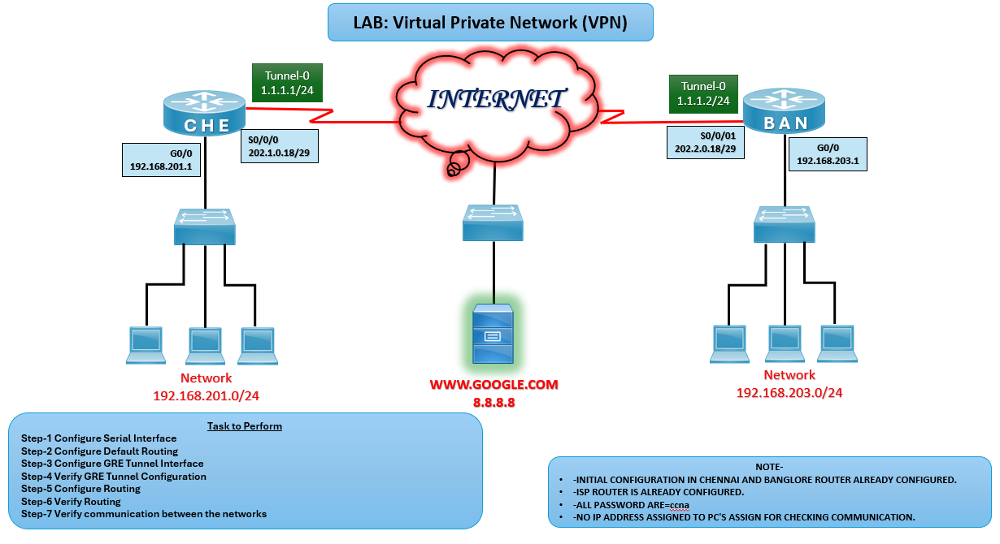

# 🌐 LAB: Virtual Private Network (VPN)

## 🎯 Objective

- Configure GRE tunnel between two routers (CHE and BAN).
- Implement default routing for Internet connectivity.
- Verify secure communication between LANs across the Internet.

## 🖼️ Lab Topology

# GRE Tunnel Lab Setup (CHE ↔ BAN)

| Device     | Interface | IP Address       |
|------------|-----------|------------------|
| Router CHE | G0/0      | 192.168.201.1/24 |
| Router CHE | S0/0/0    | 202.1.0.18/29    |
| Router CHE | Tunnel0   | 1.1.1.1/24       |
| Router BAN | G0/0      | 192.168.203.1/24 |
| Router BAN | S0/0/1    | 202.2.0.18/29    |
| Router BAN | Tunnel0   | 1.1.1.2/24       |

## ⚙️ Configuration Steps

### CHE Router Configuration

**Configure Serial Interface**  
interface s0/0/0  
ip address 202.1.0.18 255.255.255.248  
no shutdown

**Configure Default Routing**   
ip route 0.0.0.0 0.0.0.0 202.1.0.1  

**Configure GRE Tunnel Interface**  
interface tunnel 0  
ip address 1.1.1.1 255.255.255.0  
tunnel source s0/0/0  
tunnel destination 202.2.0.18

### BAN Router Configuration

**Configure Serial Interface**  
interface s0/0/1  
ip address 202.2.0.18 255.255.255.248  
no shutdown  

**Configure Default Routing**   
ip route 0.0.0.0 0.0.0.0 202.2.0.1

**Configure GRE Tunnel Interface**  
interface tunnel 0  
ip address 1.1.1.2 255.255.255.0  
tunnel source s0/0/1  
tunnel destination 202.1.0.18  

## Verification
**Verify GRE Tunnel Configuration**  
CHE# show interface tunnel 0  
BAN# show interface tunnel 0 

**Expected: Check the Tunnel IP*

**Configure Static Route between LANs**  
CHE(config)# ip route 192.168.203.0 255.255.255.0 1.1.1.2  
BAN(config)# ip route 192.168.201.0 255.255.255.0 1.1.1.1

**Verify Routing Table**  
show ip route

**Expected: Should able to see default and static route*

**Test Communication**  
CHE> ping 192.168.203.1  
BAN> ping 192.168.201.1

**Test Communication CHE PC to BAN PC and Viceversa**  
ping 192.168.203.10

**Expected: ping between CHE LAN and BAN LAN PCs should succeed.*

## ⚠️ Troubleshooting

| Issue                       | Solution                                   |
|------------------------------|--------------------------------------------|
| Tunnel down                  | Verify source/destination IPs              |
| No connectivity between LANs | Check static routes                        |
| Default route not working    | Verify ISP next-hop address                |
| PCs not communicating        | Assign correct IPs to NICs                 |

## 🌍 Real-World Use Case
- Branch office VPN connectivity across Internet
- Secure communication between geographically separated sites
- Interoperability with legacy WAN setups
- Backup tunnels for redundancy

## ✅ Outcome
- Configured GRE tunnel between CHE and BAN routers.
- Implemented default routing for Internet access.
- Verified LAN-to-LAN communication.
- Learned VPN fundamentals.

---
## 🙏 Acknowledgment
- This lab guide is part of the CCNA practice series. Thank you for following along and building your skills in networking.

---
## ✍️ Author's Note
- Prepared and documented by **Sandeep Gaikwad** for CCNA lab practice and GitHub repository organization.

---
## ✅ Closing
- Thank you for reviewing this lab manual. Keep practicing consistently — networking mastery comes with hands-on repetition.