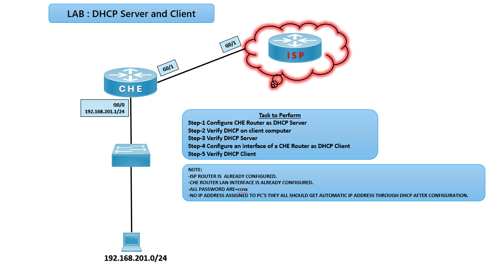

# 🌐 LAB: DHCP Server and Client

## 🎯 Objective

- Configure Router CHE as a DHCP server for LAN clients.
- Verify DHCP operation on client PCs.
- Configure CHE router interface as a DHCP client for ISP connectivity.

## 🖼️ Lab Topology

# DHCP Lab Setup (CHE ↔ ISP)

| Device      | Interface | IP Address        | Notes                                |
|-------------|-----------|-------------------|--------------------------------------|
| Router CHE  | G0/0      | 192.168.201.1/24  | LAN interface (DHCP server)          |
| Router CHE  | G0/1      | DHCP client       | Connected to ISP router              |
| Client PCs  | NIC       | DHCP assigned     | Belong to 192.168.201.0/24 LAN       |
| ISP Router  | —         | Pre‑configured    | Provides DHCP service to CHE         |

## ⚙️ Configuration Steps

## CHE Router as DHCP Server

**Configure CHE Router as DHCP Server**  
Define DHCP pool for LAN clients:

ip dhcp pool LAN-POOL  
network 192.168.201.0 255.255.255.0  
default-router 192.168.201.1  
dns-server 8.8.8.8  

### DHCP Server Verification
**Verify DHCP on Client PCs**  
Set NICs to obtain **IP automatically.  
Check IP assignment using ipconfig (Windows) or ifconfig (Linux).

**Expected: PCs should get the IPs via DHCP in 192.168.201.0 range*

**Verify DHCP Server on CHE Router**  
show ip dhcp binding  
CHE# show ip dhcp pool

## CHE Router as DHCP Client
**Configure CHE Router Interface as DHCP Client**  
interface g0/1  
ip address dhcp  
no shutdown

### DHCP Client Verification
**Verify CHE G0/1 interface**  
show ip interface brief  

**Expected: G0/1 should get the IP from ISP via DHCP*

**Verify DHCP details**  
show dhcp lease

**Expected: We should see which got assigned to PCs* 

# DHCP Troubleshooting Guide

| Issue                          | Solution                                      |
|--------------------------------|-----------------------------------------------|
| PCs not getting IP             | Check DHCP pool configuration                 |
| Wrong default gateway          | Verify `default-router` in DHCP pool          |
| CHE not receiving IP from ISP  | Ensure G0/1 set to `ip address dhcp`          |
| DNS not resolving              | Verify DNS server in DHCP pool                |

## 🌍 Real-World Use Case
- Enterprise LAN DHCP for automatic IP assignment
- Branch router DHCP client for ISP connectivity
- Simplified network management reducing manual IP configuration

## ✅ Outcome
- Configured CHE router as DHCP server for LAN.
- Verified DHCP operation on client PCs.
- Configured CHE router interface as DHCP client for ISP.
- Ensured LAN and Internet connectivity.

---
## 🙏 Acknowledgment
- This lab guide is part of the CCNA practice series. Thank you for following along and building your skills in networking.

---
## ✍️ Author's Note
- Prepared and documented by **Sandeep Gaikwad** for CCNA lab practice and GitHub repository organization.

---
## ✅ Closing
- Thank you for reviewing this lab manual. Keep practicing consistently — networking mastery comes with hands-on repetition.