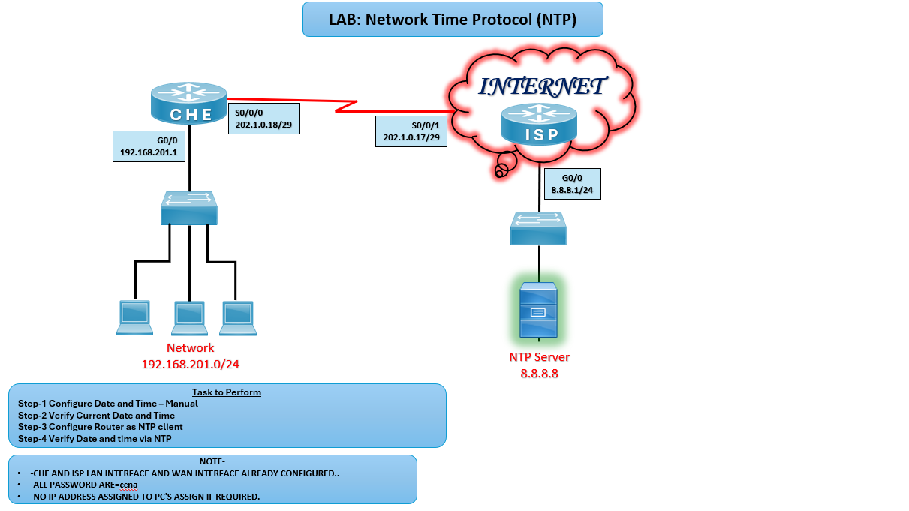

# ⏰ LAB: Network Time Protocol (NTP)

## 🎯 Objective

- Configure router date and time manually.
- Verify current date and time.
- Configure router CHE as an NTP client.
- Synchronize with external NTP server (8.8.8.8).

## 🖼️ Lab Topology

# NTP Lab Setup (CHE ↔ ISP ↔ NTP Server)

| Device      | Interface | IP Address       | Notes                          |
|-------------|-----------|------------------|--------------------------------|
| Router CHE  | G0/0      | 192.168.201.1/24 | LAN interface                  |
| Router CHE  | S0/0/0    | 202.1.0.18/29    | WAN link to ISP                |
| Router ISP  | S0/0/1    | 202.1.0.17/29    | WAN link to CHE                |
| Router ISP  | G0/0      | 8.8.8.1/24       | Connected to NTP server        |
| NTP Server  | —         | 8.8.8.8          | External time source           |

## ⚙️ Configuration Steps

### CHE Router Configuration
 
**Configure Date and Time – Manually**  
CHE# clock set 16:00:00 12 July 2026

**Verify Current Date and Time**  
CHE# show clock

**Configure Router CHE as NTP Client**  
CHE(config)# ntp server 8.8.8.8  
CHE(config)# ntp update-calendar

**Verify Date and Time via NTP**  
CHE# show ntp associations  
CHE# show ntp status  
CHE# show clock  

## Verification
- **show clock** should display synchronized time.
- **show ntp status** should indicate synchronization with server 8.8.8.8.
- PCs in LAN can sync time if configured to use router as NTP source.

## ⚠️ Troubleshooting

| Issue                        | Solution                                           |
|------------------------------|----------------------------------------------------|
| Router not syncing           | Verify reachability to NTP server (`ping 8.8.8.8`) |
| Wrong time zone              | Configure `clock timezone IST +5 30`               |
| NTP associations not showing | Check NTP server IP and configuration              |

## 🌍 Real-World Use Case
- Time synchronization across enterprise routers.
- Accurate logging for troubleshooting and audits.
- Security compliance requiring synchronized timestamps.

## ✅ Outcome
- CHE router synchronized with external NTP server.
- Accurate time maintained across LAN devices.
- Verified NTP associations and clock consistency.

---
## 🙏 Acknowledgment
- This lab guide is part of the CCNA practice series. Thank you for following along and building your skills in networking.

---
## ✍️ Author's Note
- Prepared and documented by **Sandeep Gaikwad** for CCNA lab practice and GitHub repository organization.

---
## ✅ Closing
- Thank you for reviewing this lab manual. Keep practicing consistently — networking mastery comes with hands-on repetition.