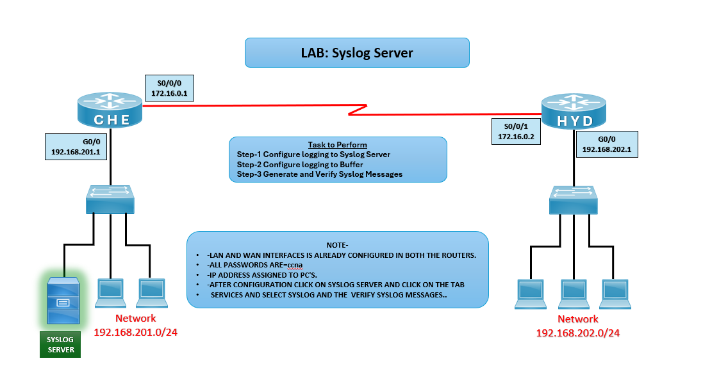

# 🖥️ LAB: Syslog Server

## 🎯 Objective

- Configure routers CHE and HYD to send logs to a Syslog server.
- Enable local logging to buffer.
- Generate and verify Syslog messages.

## 🖼️ Lab Topology

# Syslog Lab Setup (CHE ↔ HYD ↔ Syslog Server)

| Device        | Interface | IP Address       | Notes                          |
|---------------|-----------|------------------|--------------------------------|
| Router CHE    | S0/0/0    | 172.16.0.1/30    | Serial link to HYD             |
| Router CHE    | G0/0      | 192.168.201.1/24 | LAN with Syslog server + PCs   |
| Router HYD    | S0/0/1    | 172.16.0.2/30    | Serial link to CHE             |
| Router HYD    | G0/0      | 192.168.202.1/24 | LAN with PCs                   |
| Syslog Server | NIC       | 192.168.201.x/24 | Collects logs from routers     |

## ⚙️ Configuration Steps

### CHE Router
**Configure Logging to Syslog Server**  
CHE(config)# logging 192.168.201.10  
CHE(config)# logging trap debugging

**Configure Logging to Buffer**  
CHE(config)# logging buffered 8192

## Verification
**Generate and Verify Syslog Messages**  
Shutdown serial interface so that log can genrate

CHE(config)# interface s0/0/0  
CHE(config-if)# shutdown  
CHE(config-if)# no shutdown  

**Verify logs locally**  
CHE# show logging

**Verify logs in Syslog Server**
- Click on Syslog server
- Click on Services
- Click on Syslog Tab and check the logs

## ⚠️ Troubleshooting

# Syslog Troubleshooting Guide

| Issue                    | Solution                                   |
|--------------------------|--------------------------------------------|
| No logs on Syslog server | Verify IP reachability to server           |
| Logs not buffered        | Check `logging buffered` configuration     |
| Wrong Syslog server IP   | Ensure correct server IP in `logging`      |

## 🌍 Real-World Use Case
- Centralized logging for enterprise networks.
- Troubleshooting router and interface issues.
- Security monitoring with log analysis tools.

## ✅ Outcome
- Configured CHE and HYD routers to send logs to Syslog server.
- Enabled local buffer logging.
- Verified Syslog messages successfully collected.

---
## 🙏 Acknowledgment
- This lab guide is part of the CCNA practice series. Thank you for following along and building your skills in networking.

---
## ✍️ Author's Note
- Prepared and documented by **Sandeep Gaikwad** for CCNA lab practice and GitHub repository organization.

---
## ✅ Closing
- Thank you for reviewing this lab manual. Keep practicing consistently — networking mastery comes with hands-on repetition.