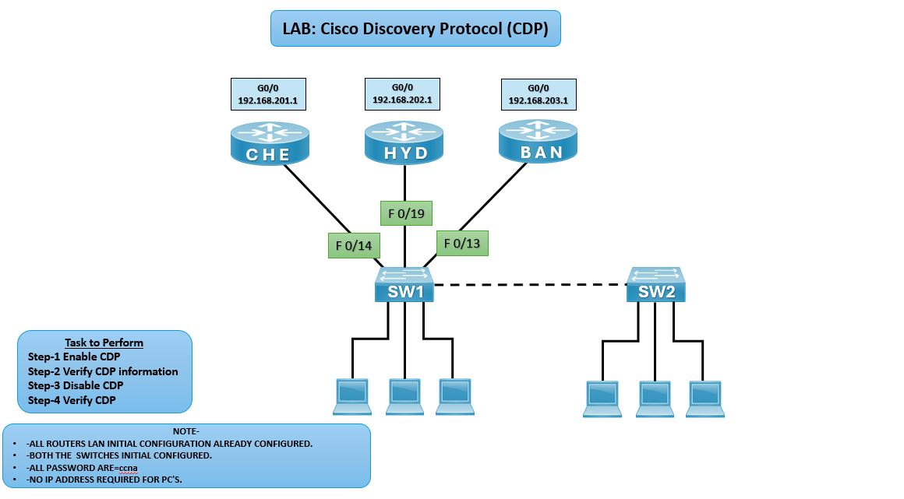

# 🔎 LAB: Cisco Discovery Protocol (CDP)

## 🎯 Objective

- Enable CDP on routers CHE, HYD, and BAN.
- Verify CDP neighbor information.
- Disable CDP when not required.
- Confirm CDP status after disabling.

## 🖼️ Lab Topology

# Multi‑Router LAN/WAN Lab Setup (CHE ↔ HYD ↔ BAN via SW1/SW2)

| Device     | Interface   | IP Address      | Notes                          |
|------------|-------------|-----------------|--------------------------------|
| Router CHE | G0/0        | 192.168.201.1   | Connected to SW1 (F0/14)       |
| Router HYD | G0/0        | 192.168.202.1   | Connected to SW1 (F0/19)       |
| Router BAN | G0/0        | 192.168.203.1   | Connected to SW1 (F0/13)       |
| Switch SW1 | F0/14,19,13 | —               | Connected to CHE, HYD, BAN     |
| Switch SW2 | Uplink      | —               | Connected to SW1               |
| PCs        | NIC         | —               | Connected to SW1/SW2           |

## ⚙️ Configuration Steps

**Enable CDP**  
Router/Switch(Config)# cdp run

**Note: Above command need to run in all the cisco devices to make CDP enable**

**Verify CDP Information**  
CHE# show cdp neighbors

**Expected: It will show all the directly connected Cisco Dev**ices information*

**Disable CDP**  
CHE(config)# no cdp run

**Or**

**Disable on per interface**  
CHE(config)# interface g0/0  
CHE(config-if)# no cdp enable

**Verify CDP After Disabling**  
CHE# show cdp neighbors

**Expected: It will not show any neighbor details*

## Troubleshooting

| Issue                    | Solution                                               |
|--------------------------|--------------------------------------------------------|
| No neighbors discovered  | Ensure CDP is enabled globally and on interfaces       |
| Incorrect neighbor info  | Verify interface connections and cabling               |
| CDP not disabling        | Check if disabled globally or per interface            |

## 🌍 Real-World Use Case
- Network discovery in multi‑router environments.
- Troubleshooting connectivity between routers and switches.
- Security hardening by disabling CDP where not needed.

## ✅ Outcome
- Enabled CDP on CHE, HYD, and BAN routers.
- Verified neighbor information.
- Disabled CDP and confirmed it no longer displayed neighbors.

---
## 🙏 Acknowledgment
- This lab guide is part of the CCNA practice series. Thank you for following along and building your skills in networking.

---
## ✍️ Author's Note
- Prepared and documented by **Sandeep Gaikwad** for CCNA lab practice and GitHub repository organization.

---
## ✅ Closing
- Thank you for reviewing this lab manual. Keep practicing consistently — networking mastery comes with hands-on repetition.