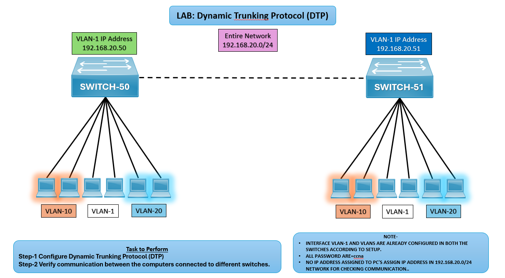

# 🔎 LAB: Dynamic Trunking Protocol (DTP)

## 🎯 Objective

- Configure DTP between SWITCH‑50 and SWITCH‑51.
- Verify communication between VLANs across trunk link.

## 🖼️ Lab Topology

# VLAN Lab Setup (SWITCH‑50 ↔ SWITCH‑51)

| Device      | Interface | IP Address              | Notes                                       |
|-------------|-----------|-------------------------|---------------------------------------------|
| SWITCH‑50   | VLAN‑1     | 192.168.20.50           | Connected to PCs in VLAN‑10, VLAN‑20, VLAN‑1 |
| SWITCH‑51   | VLAN‑1    | 192.168.20.51            | Connected to PCs in VLAN‑10, VLAN‑20, VLAN‑1 |
| VLANs       | —         | VLAN‑10, VLAN‑20, VLAN‑1 | Configured on both switches                 |
| PCs         | NIC       | 192.168.20.x            | Assigned IPs in 192.168.20.0/24 LAN         |

## ⚙️ Configuration Steps

### Switch-50

**Configure DTP on SWITCH‑50**  
SWITCH-50(config)# interface fa0/1  
SWITCH-50(config-if)# switchport mode dynamic desirable

### Switch-51

**Configure DTP on SWITCH‑51**  
SWITCH-51(config)# interface fa0/1  
SWITCH-51(config-if)# switchport mode dynamic auto

**Verify Trunk Formation on both the Switches**  
SWITCH-50# show interfaces trunk  
SWITCH-51# show interfaces trunk  

**Verify Communication Between PCs**
- Assign IPs in 192.168.20.0/24 to PCs in VLAN‑10, VLAN‑20, VLAN‑1.
- Test connectivity with ping between PCs in the same VLAN but connected to different switches.

## Verification Output
- show interfaces trunk should confirm trunk established between SWITCH‑50 and SWITCH‑51.

- PCs in same VLAN across different switches should communicate successfully.

## ⚠️ Troubleshooting

| Issue                      | Solution                                                                 |
|----------------------------|--------------------------------------------------------------------------|
| Trunk not forming          | Ensure one side is `dynamic desirable` and the other `dynamic auto`      |
| VLAN communication failing | Verify VLANs exist on both switches                                      |
| PCs not communicating      | Check IP assignment in 192.168.20.0/24   

## 🌍 Real-World Use Case
- Dynamic trunking simplifies VLAN communication setup.
- Inter-switch VLAN connectivity in enterprise networks.
- Scalable VLAN design for multi-switch environments.

## ✅ Outcome
- Configured DTP between SWITCH‑50 and SWITCH‑51.
- Verified VLAN communication across trunk link.
- Ensured proper IP assignment for PCs.

---
## 🙏 Acknowledgment
- This lab guide is part of the CCNA practice series. Thank you for following along and building your skills in networking.

---
## ✍️ Author's Note
- Prepared and documented by **Sandeep Gaikwad** for CCNA lab practice and GitHub repository organization.

---
## ✅ Closing
- Thank you for reviewing this lab manual. Keep practicing consistently — networking mastery comes with hands-on repetition.
