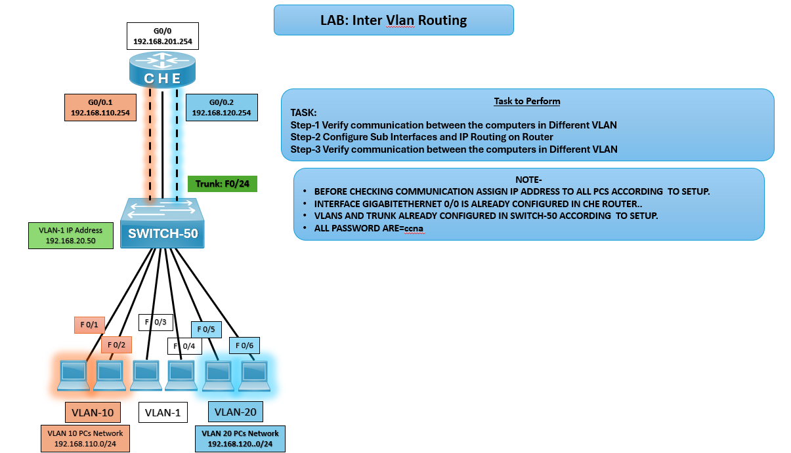

# 🌐 LAB: Inter‑VLAN Routing

## 🎯 Objective
- Verify communication between PCs in different VLANs.  
- Configure sub‑interfaces and IP routing on the router CHE.  
- Verify communication across VLANs after configuration.

## 🖼️ Lab Topology

## Device Interface Table

| Device     | Interface | IP Address       | Notes                           |
|------------|-----------|------------------|-------------------------------- |
| Router CHE | G0/0      | 192.168.201.254  | Physical interface to SWITCH‑50 |
| Router CHE | G0/0.1    | 192.168.110.254  | Sub‑interface for VLAN‑10       |
| Router CHE | G0/0.2    | 192.168.120.254  | Sub‑interface for VLAN‑20       |
| SWITCH‑50  | F0/24     | Trunk link       | Connected to CHE router         |

## ⚙️ Configuration Steps
**Verify Communication Between VLANs (Before Routing)**
- Assign IP addresses to PCs according to VLAN setup.  
- Test connectivity with `ping` between PCs in different VLANs (will fail before routing).  

### CHE Router Configuration

**Configure Sub‑Interfaces on Router**  
CHE(config)# interface g0/0.1  
CHE(config-subif)# encapsulation dot1Q 10  
CHE(config-subif)# ip address 192.168.110.254 255.255.255.0

CHE(config)# interface g0/0.2  
CHE(config-subif)# encapsulation dot1Q 20  
CHE(config-subif)# ip address 192.168.120.254 255.255.255.0

**Enable IP Routing**  
CHE(config)# ip routing

**Verify Communication Between VLANs (After Routing)**  
Ping between PCs in VLAN‑10 and VLAN‑20.  
Ping router sub‑interfaces to confirm gateway reachability.

## ✅ Verification Output
- ping between PCs in VLAN‑10 and VLAN‑20 should succeed.
- Router CHE should route traffic between VLANs via sub‑interfaces.
- **show ip route** on CHE should display connected networks.

## ⚠️ Troubleshooting

| Issue                    | Solution                                                       |
|--------------------------|----------------------------------------------------------------|
| PCs not communicating    | Check IP assignment and default gateway                        |
| Router not routing       | Verify sub‑interface encapsulation and IP configuration        |
| VLAN traffic not passing | Confirm trunk configuration on SWITCH‑50                       |

## 🌍 Real‑World Use Case
- Inter‑VLAN routing enables communication between segmented VLANs.
- Router‑on‑a‑stick is a cost‑effective design for small networks.
- Enterprise VLAN design improves scalability and security.

## ✅ Outcome
- Configured CHE router with sub‑interfaces for VLAN‑10 and VLAN‑20.
- Verified communication between PCs in different VLANs.
- Achieved successful inter‑VLAN routing.

---
## 🙏 Acknowledgment
- This lab guide is part of the CCNA practice series. Thank you for following along and building your skills in networking.

---
## ✍️ Author's Note
- Prepared and documented by **Sandeep Gaikwad** for CCNA lab practice and GitHub repository organization.

---
## ✅ Closing
- Thank you for reviewing this lab manual. Keep practicing consistently — networking mastery comes with hands-on repetition.