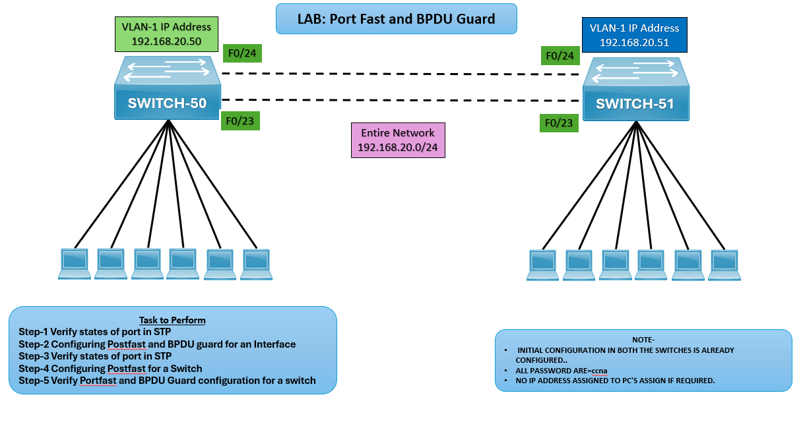

# 🖧 LAB: PortFast and BPDU Guard

## 🎯 Objective
- Verify STP port states.  
- Configure PortFast and BPDU Guard on interfaces.  
- Verify STP states after configuration.  
- Configure PortFast globally on a switch.  
- Verify PortFast and BPDU Guard operation.  

## 🖼️ Lab Topology

| Device     | Interface | IP Address     | Notes                                                   |
|------------|-----------|----------------|---------------------------------------------------------|
| SWITCH‑50  | VLAN‑1    | 192.168.20.50  | Connected to PCs via Fa0/1–Fa0/6, uplinks Fa0/23–Fa0/24 |
| SWITCH‑51  | VLAN‑1    | 192.168.20.51  | Connected to PCs via Fa0/1–Fa0/6, uplinks Fa0/23–Fa0/24 |
| PCs        | NIC       | 192.168.20.x   | Assigned IPs in 192.168.20.0/24                         |

## ⚙️ Configuration Steps

**Verify STP Port States on both the Switches**  
SWITCH-50# show spanning-tree  
SWITCH-51# show spanning-tree

**Configure PortFast and BPDU Guard on Interfaces**  
SWITCH-50(config)# interface range fa0/1-6  
SWITCH-50(config-if-range)# spanning-tree portfast  
SWITCH-50(config-if-range)# spanning-tree bpduguard enable

SWITCH-51(config)# interface range fa0/1-6  
SWITCH-51(config-if-range)# spanning-tree portfast  
SWITCH-51(config-if-range)# spanning-tree bpduguard enable

**Verify STP States After Configuration**  
SWITCH-50# show spanning-tree interface fa0/1 detail  
SWITCH-51# show spanning-tree interface fa0/1 detail

**Configure PortFast Globally**  
SWITCH-50(config)# spanning-tree portfast default  
SWITCH-51(config)# spanning-tree portfast default

**Verify PortFast and BPDU Guard**  
SWITCH-50# show running-config  
SWITCH-50# show spanning-tree summary  

SWITCH-51# show running-config  
SWITCH-51# show spanning-tree summary  

## ✅ Verification Output
- Ports connected to PCs should transition directly to forwarding state.
- BPDU Guard should disable a port if a BPDU is received.
- Global PortFast ensures all access ports enable PortFast by default.

## ⚠️ Troubleshooting

| Issue                         | Solution                                             |
|-------------------------------|------------------------------------------------------|
| Ports not entering forwarding | Ensure PortFast is enabled on access ports           |
| BPDU Guard not triggering     | Confirm BPDU Guard is enabled on the interface       |
| PCs losing connectivity       | Check if port was err-disabled due to BPDU violation |

## 🌍 Real-World Use Case
- Faster convergence for end‑user devices.
- Loop prevention by disabling misconfigured ports.
- Enterprise best practices for secure and stable LAN design.

## ✅ Outcome
- Verified STP port states.
- Configured PortFast and BPDU Guard on SWITCH‑50 and SWITCH‑51.
- Tested and confirmed secure, fast port transitions.

---
## 🙏 Acknowledgment
- This lab guide is part of the CCNA practice series. Thank you for following along and building your skills in networking.

---
## ✍️ Author's Note
- Prepared and documented by **Sandeep Gaikwad** for CCNA lab practice and GitHub repository organization.

---
## ✅ Closing
- Thank you for reviewing this lab manual. Keep practicing consistently — networking mastery comes with hands-on repetition.