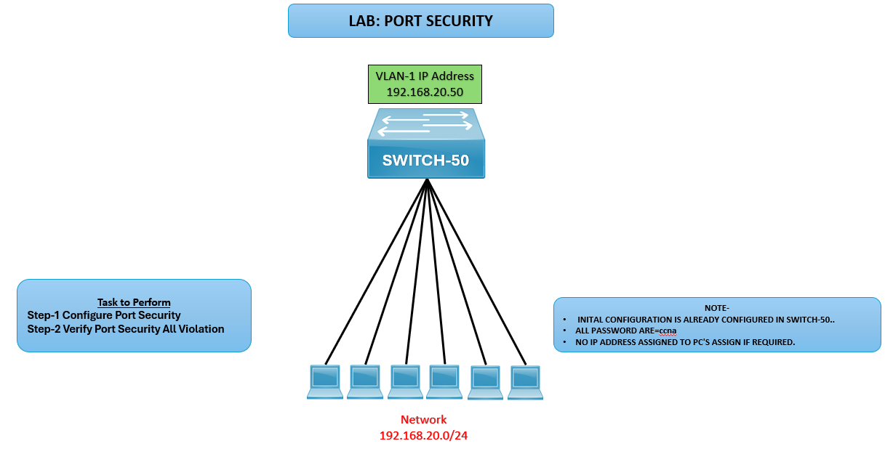

# 🔒 LAB: Port Security

## 🎯 Objective
- Configure port security on SWITCH‑50.  
- Verify port security violations. 

## 🖼️ Lab Topology

| Device     | Interface | IP Address     | Notes                            |
|------------|-----------|----------------|----------------------------------|
| SWITCH‑50  | VLAN‑1    | 192.168.20.50  | Connected to PCs via Fa0/1–Fa0/6 |
| PCs        | NIC       | 192.168.20.x   | Assigned IPs in 192.168.20.0/24  |

## ⚙️ Configuration Steps

## SWITCH 50 Configuration
**Enable Port Security on Interfaces**  
SWITCH-50(config)# interface range fa0/1-6  
SWITCH-50(config-if-range)# switchport mode access  
SWITCH-50(config-if-range)# switchport port-security  
SWITCH-50(config-if-range)# switchport port-security maximum 2  
SWITCH-50(config-if-range)# switchport port-security violation shutdown  
SWITCH-50(config-if-range)# switchport port-security mac-address sticky  

## Verification
**Verify Port Security**  
SWITCH-50# show port-security  
SWITCH-50# show port-security interface fa0/1

**Test Violation**  
- Connect an unauthorized device to a secured port.
- Observe violation mode (shutdown) disabling the port.
- Verify logs with: **show logging**

## ✅ Verification Output
- **show port-security** confirms enabled status and maximum MAC addresses.
- Unauthorized devices trigger violation and port shutdown.
- Sticky MAC addresses are learned and saved.

## ⚠️ Troubleshooting
| Issue                    | Solution                                               |
|--------------------------|--------------------------------------------------------|
| Port not shutting down   | Check violation mode configuration                     |
| Too many devices allowed | Adjust `maximum` MAC address setting                   |
| Sticky MAC not saving    | Ensure `mac-address sticky` is enabled                 |

## 🌍 Real-World Use Case
- Prevent unauthorized access in enterprise LANs.
- Limit devices per port for compliance.
- Enhance network security by shutting down suspicious connections.

## ✅ Outcome
- Configured port security on SWITCH‑50.
- Verified violation handling and sticky MAC learning.
- Ensured secure access control for connected PCs.

---
## 🙏 Acknowledgment
- This lab guide is part of the CCNA practice series. Thank you for following along and building your skills in networking.

---
## ✍️ Author's Note
- Prepared and documented by **Sandeep Gaikwad** for CCNA lab practice and GitHub repository organization.

---
## ✅ Closing
- Thank you for reviewing this lab manual. Keep practicing consistently — networking mastery comes with hands-on repetition.
