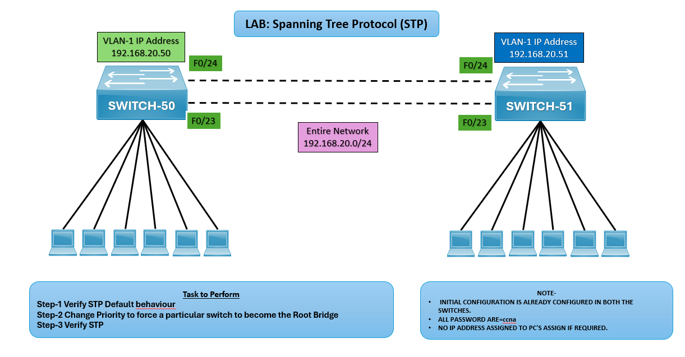

# 🌐 LAB: Spanning Tree Protocol (STP)

## 🎯 Objective
- Verify STP default behavior.  
- Change switch priority to force a particular switch to become the Root Bridge.  
- Verify STP operation after changes.  

## 🖼️ Lab Topology

## Device Interface Table
| Device     | Interface | IP Address     | Notes                                  |
|------------|-----------|----------------|----------------------------------------|
| SWITCH‑50  | VLAN‑1    | 192.168.20.50  | Connected to PCs, uplinks Fa0/23–Fa0/24 |
| SWITCH‑51  | VLAN‑1    | 192.168.20.51  | Connected to PCs, uplinks Fa0/23–Fa0/24 |

## ⚙️ Configuration Steps
**Verify STP Default Behavior**  
SWITCH-50# show spanning-tree  
SWITCH-51# show spanning-tree

**Change Priority to Force Root Switch on Switch-50**   
SWITCH-50(config)# spanning-tree vlan 1 priority 4096

**Verify STP After Configuration**  
SWITCH-50# show spanning-tree vlan 1  
SWITCH-51# show spanning-tree vlan 1

## ✅ Verification Output
- The designated root bridge should now be SWITCH‑50.
- Ports should transition to proper STP states (root, designated, blocking).
- No loops should exist in the topology.

## ⚠️ Troubleshooting
| Issue                        | Solution                                                       |
|------------------------------|----------------------------------------------------------------|
| Wrong switch is root         | Verify priority values and reconfigure                         |
| Ports stuck in blocking state| Check redundant links and STP timers                           |
| PCs losing connectivity      | Ensure correct VLAN assignment and trunk configuration         |

## 🌍 Real‑World Use Case
- Loop prevention in redundant switch topologies.
- Root bridge selection for optimal traffic flow.
- Enterprise LAN stability using STP best practices.

## ✅ Outcome
- Verified STP default behavior.
- Configured SWITCH‑50 as the root bridge.
- Confirmed stable STP operation across the network.

---
## 🙏 Acknowledgment
- This lab guide is part of the CCNA practice series. Thank you for following along and building your skills in networking.

---
## ✍️ Author's Note
- Prepared and documented by **Sandeep Gaikwad** for CCNA lab practice and GitHub repository organization.

---
## ✅ Closing
- Thank you for reviewing this lab manual. Keep practicing consistently — networking mastery comes with hands-on repetition.