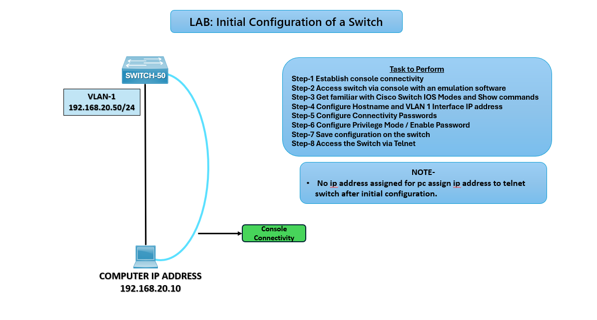

# 🖧 LAB: Initial Configuration of a Switch

## 🎯 Objective
- Establish console connectivity to SWITCH‑50.  
- Access switch via console using emulation software.  
- Get familiar with Cisco IOS modes and show commands.  
- Configure hostname and VLAN‑1 interface IP address.  
- Configure connectivity passwords.  
- Configure privilege mode / enable password.  
- Save configuration on the switch.  
- Access the switch via Telnet.  

## 🖼️ Lab Topology

## Device Interface Table

| Device     | Interface | IP Address     | Notes                           |
|------------|-----------|----------------|---------------------------------|
| PC         | NIC       | 192.168.20.10  | Console connection to SWITCH‑50 |
| SWITCH‑50  | VLAN‑1    | 192.168.20.50  | Management IP for Telnet access |

## ⚙️ Configuration Steps

**Step 1: Establish Console Connectivity**
- Connect PC to SWITCH‑50 via console cable.  
- Use terminal emulation software (e.g., PuTTY, Tera Term). 

**Step 2: Familiarize with IOS Modes**
- User EXEC mode: `Switch>`  
- Privileged EXEC mode: `Switch#`  
- Global Configuration mode: `Switch(config)#`  

**Step 3: Configure Hostname**  
Switch> enable  
Switch# configure terminal  
Switch(config)# hostname SWITCH-50

**Step 4: Configure VLAN‑1 Interface IP Address**  
SWITCH-50(config)# interface vlan 1  
SWITCH-50(config-if)# ip address 192.168.20.50 255.255.255.0  
SWITCH-50(config-if)# no shutdown

**Step 5: Configure Connectivity Passwords**  
SWITCH-50(config)# line console 0  
SWITCH-50(config-line)# password ccna  
SWITCH-50(config-line)# login

SWITCH-50(config)# line vty 0 4  
SWITCH-50(config-line)# password ccna  
SWITCH-50(config-line)# login

**Step 6: Configure Enable Password**  
SWITCH-50(config)# enable secret ccna

**Step 7: Save Configuration**  
SWITCH-50# write memory

**Step 8: Access Switch via Telnet**  
- Assign IP 192.168.20.10 to PC.
- Test connectivity: ping 192.168.20.50.
- Access switch via Telnet:

telnet 192.168.20.50

## ✅ Verification Output
- Console access successful.
- Hostname and IP configured.
- Passwords enforced on console and Telnet.
- Telnet access verified from PC.

## ⚠️ Troubleshooting

| Issue                    | Solution                                                       |
|--------------------------|----------------------------------------------------------------|
| Cannot access via Telnet | Verify VLAN‑1 IP and PC IP configuration                       |
| Password not working     | Ensure `login` is enabled under line configuration             |
| No connectivity          | Check cable connections and `no shutdown` on VLAN‑1            |

## 🌍 Real‑World Use Case
- Switch initial setup for enterprise networks.
- Remote management using VLAN‑1 IP.
- Network security with console and enable passwords.

## ✅ Outcome
- SWITCH‑50 configured with hostname, VLAN‑1 IP, and passwords.
- Configuration saved and verified.
- Remote access via Telnet established.

---
## 🙏 Acknowledgment
- This lab guide is part of the CCNA practice series. Thank you for following along and building your skills in networking.

---
## ✍️ Author's Note
- Prepared and documented by **Sandeep Gaikwad** for CCNA lab practice and GitHub repository organization.

---
## ✅ Closing
- Thank you for reviewing this lab manual. Keep practicing consistently — networking mastery comes with hands-on repetition.