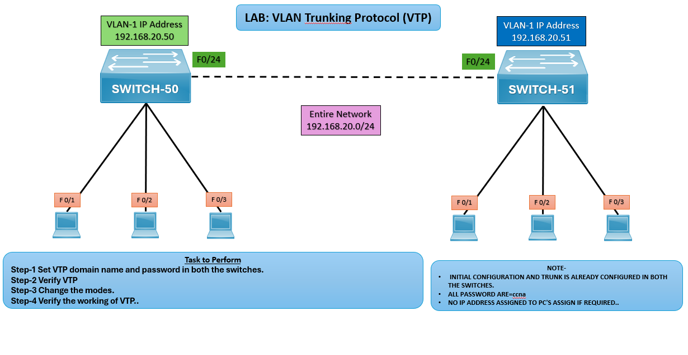

# 🖧 LAB: VLAN Trunking Protocol (VTP)

## 🎯 Objective

- Configure VTP domain name and password on SWITCH‑50 and SWITCH‑51.
- Verify VTP operation.
- Change VTP modes (Server, Client, Transparent).
- Confirm synchronization of VLAN information.

## 🖼️ Lab Topology

## Device Interface Table

| Device     | Interface | IP Address    | Notes                                |
|------------|-----------|---------------|--------------------------------------|
| SWITCH‑50  | VLAN‑1    | 192.168.20.50 | Connected to PCs via F0/1–F0/3       |
| SWITCH‑51  | VLAN‑1    | 192.168.20.51 | Connected to PCs via F0/1–F0/3       |
| Trunk Link | F0/24     | —             | Between SWITCH‑50 and SWITCH‑51      |

## ⚙️ Configuration Steps

### SWITCH 50 Configuration

**Set VTP Domain and Password**  

SWITCH-50(config)# vtp domain CCNA  
SWITCH-50(config)# vtp password ccna  

**Verify VTP Status**  
SWITCH-50# show vtp status

### SWITCH 51 Configuration

**Set VTP Domain and Password**  

SWITCH-51(config)# vtp domain CCNA  
SWITCH-51(config)# vtp password ccna  

**Verify VTP Status**  
SWITCH-51# show vtp status

**Configure VTP Server Mode on SWITCH 50**  
SWITCH-50(config)# vtp mode server

**Configure VTP Client Mode on SWITCH 51**  
SWITCH-51(config)# vtp mode client

## Verification
**Create VLANs on Server Switch that is SWITCH50**  
SWITCH-50(config)# vlan 10  
SWITCH-50(config-vlan)# name SALES  
SWITCH-50(config)# vlan 20  
SWITCH-50(config-vlan)# name HR  

**Verify VLAN Propagation on Client Switch that is SWITCH51**  
SWITCH-51# show vlan brief

## ✅ Verification Output
- **show vtp status** confirms domain, mode, and revision number.
- VLANs created on the **Server** should appear on the **Client**.
- Transparent mode does not synchronize VLANs but forwards advertisements.

## ⚠️ Troubleshooting
| Issue                       | Solution                                                      |
|-----------------------------|---------------------------------------------------------------|
| VLANs not propagating       | Ensure trunk link is configured and active                    |
| Revision number not updating| Verify VTP domain and password match                          |
| Wrong mode                  | Confirm one switch is Server, the other Client                |

## 🌍 Real-World Use Case
- Centralized VLAN management in enterprise networks.
- Simplified VLAN deployment across multiple switches.
- Network scalability with consistent VLAN configuration.

## ✅ Outcome
- Configured VTP domain and password on both switches.
- Verified VTP operation and synchronization.
- Successfully tested Server, Client, and Transparent modes.

---
## 🙏 Acknowledgment
- This lab guide is part of the CCNA practice series. Thank you for following along and building your skills in networking.

---
## ✍️ Author's Note
- Prepared and documented by **Sandeep Gaikwad** for CCNA lab practice and GitHub repository organization.

---
## ✅ Closing
- Thank you for reviewing this lab manual. Keep practicing consistently — networking mastery comes with hands-on repetition.
