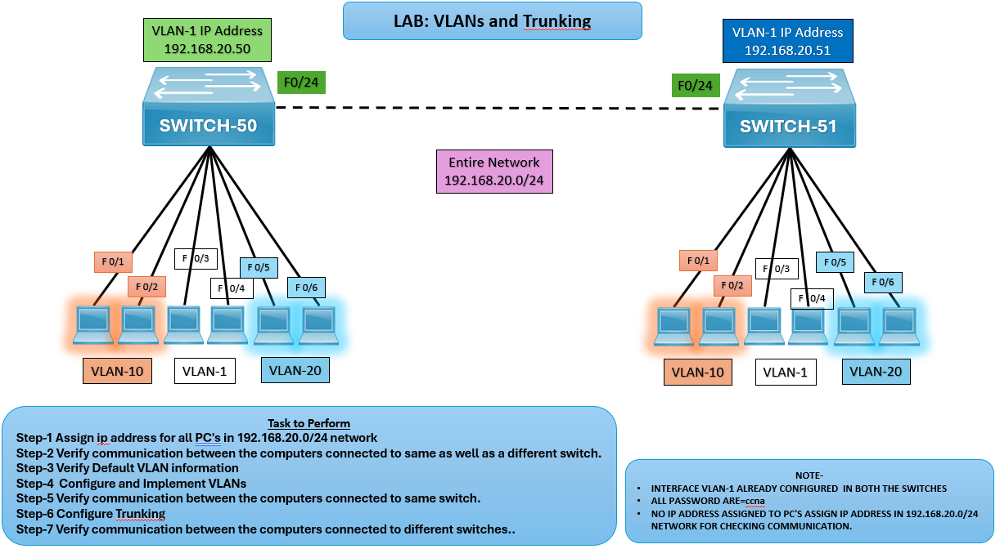

# 🖧 LAB: VLANs and Trunking

## 🎯 Objective

- Assign IP addresses to PCs in the 192.168.20.0/24 network.
- Configure and implement VLANs on SWITCH‑50 and SWITCH‑51.
- Configure trunking between switches.
- Verify communication within and across VLANs.

## 🖼️ Lab Topology

## Device Interface Table

| Device     | Interface | IP Address               | Notes                                        |
|------------|-----------|--------------------------|----------------------------------------------|
| SWITCH‑50  | VLAN‑1    | 192.168.20.50            | Connected to PCs in VLAN‑10, VLAN‑20, VLAN‑1 |
| SWITCH‑51  | VLAN‑1    | 192.168.20.51            | Connected to PCs in VLAN‑10, VLAN‑20, VLAN‑1 |
| PCs        | NIC       | 192.168.20.x             | Assigned IPs in 192.168.20.0/24 LAN          |
| VLANs      | —         | VLAN‑10, VLAN‑20, VLAN‑1 | Configured on both switches                  |

## ⚙️ Configuration Steps

**Assign IP addresses to PCs**  
Configure each PC with an IP in 192.168.20.0/24 and default gateway as the switch VLAN‑1 IP.

### SWITCH 50 Configuration

**Verify communication in default VLAN**  
SWITCH-50# show vlan brief

**Note: Ping between PCs in VLAN‑1 to confirm connectivity.**

**Configure VLANs on SWITCH‑50**  
SWITCH-50(config)# vlan 10  
SWITCH-50(config-vlan)# name SALES  
SWITCH-50(config)# vlan 20  
SWITCH-50(config-vlan)# name HR  
SWITCH-50(config)# interface range fa0/1-2  
SWITCH-50(config-if-range)# switchport mode access  
SWITCH-50(config-if-range)# switchport access vlan 10  
SWITCH-50(config)# interface range fa0/3-4  
SWITCH-50(config-if-range)# switchport mode access  
SWITCH-50(config-if-range)# switchport access vlan 20  

### SWITCH 51 Configuration  
**Configure VLANs on SWITCH‑51**   
SWITCH-51(config)# vlan 10  
SWITCH-51(config-vlan)# name SALES  
SWITCH-51(config)# vlan 20  
SWITCH-51(config-vlan)# name HR  
SWITCH-51(config)# interface range fa0/1-2  
SWITCH-51(config-if-range)# switchport mode access  
SWITCH-51(config-if-range)# switchport access vlan 10  
SWITCH-51(config)# interface range fa0/3-4  
SWITCH-51(config-if-range)# switchport mode access  
SWITCH-51(config-if-range)# switchport access vlan 20  

**Verify communication within same switch VLANs**  
Ping between PCs in VLAN‑10 and VLAN‑20 on the same switch.

### Trunk Configuration
**Configure trunking between SWITCH‑50 and SWITCH‑51**

SWITCH-50(config)# interface fa0/24  
SWITCH-50(config-if)# switchport mode trunk  

SWITCH-51(config)# interface fa0/24  
SWITCH-51(config-if)# switchport mode trunk

**Verify communication across switches**  
- Ping between PCs in VLAN‑10 on SWITCH‑50 and VLAN‑10 on SWITCH‑51.
- Repeat for VLAN‑20.

## Verification Output
- **show vlan brief** should confirm VLANs are created and ports assigned.
- **show interfaces trunk** should confirm trunk link is active.
- PCs in same VLAN across different switches should communicate successfully.

## ⚠️ Troubleshooting

| Issue                    | Solution                                                                 |
|--------------------------|--------------------------------------------------------------------------|
| PCs not communicating    | Check IP assignment and VLAN membership                                  |
| VLAN traffic not passing | Verify trunk configuration on Fa0/24                                     |
| Wrong VLAN assignment    | Confirm ports are correctly mapped                                       |

## 🌍 Real-World Use Case
- Enterprise VLAN segmentation for traffic isolation.
- Inter-switch trunking for scalable networks.
- Improved security by separating user groups.

## ✅ Outcome
- VLANs configured on SWITCH‑50 and SWITCH‑51.
- Trunk link established between switches.
- Verified communication within and across VLANs.

---
## 🙏 Acknowledgment
- This lab guide is part of the CCNA practice series. Thank you for following along and building your skills in networking.

---
## ✍️ Author's Note
- Prepared and documented by **Sandeep Gaikwad** for CCNA lab practice and GitHub repository organization.

---
## ✅ Closing
- Thank you for reviewing this lab manual. Keep practicing consistently — networking mastery comes with hands-on repetition.